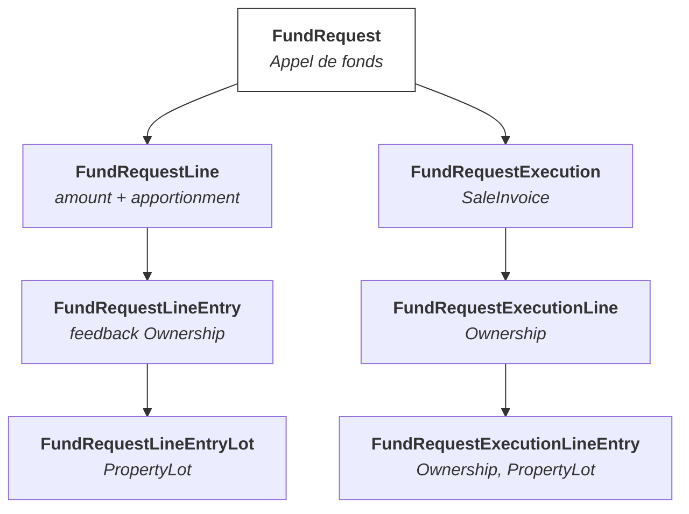

## Appels de fonds
### Présentation 
Du budget voté en AG, découle la planification des appels de fonds en début d'exercice.

On planifie les appels (`FundRequest`) pour tout l'exercice et pour tous les copropriétaires. Les appels de fonds sont décomposés en entrées distinctes, selon une clé de répartition, entre les copropriétaires, et planifiés selon la date de début et la fréquence renseignés.

Un appel peut être modifié en cours d'année. Il peut en effet y avoir des montants prévisionnels qui sont établis en attendant la validation du budget (on n'appelle normalement pas de montants qu'on sait trop élevés).


Un appel de fonds est considéré comme **facture de vente**, et encodé comme tel (**journal de ventes**).

Types d'appels:

* fonds de roulement
* fonds de réserve
* provision pour charge
* provision pour charge exceptionnelle


#### Fonds de roulement

Le fonds de roulement d’une copropriété équivaut au capital d’une société, il est constitué au début de la vie de l’immeuble et reste fixe au passif du bilan. Il pourra cependant être adapté au cours de la vie de l’immeuble pour rester aligner avec l’inflation ou en cas de changement de type de décompte (il doit être plus important si les décomptes sont à frais réels sans appel de provisions pour permettre au syndic d’honorer les factures de la période en cours).  En théorie, le fonds de roulement correspond au compte courant.


A la création de la copro, on constitue un fonds de roulement pour payer les factures dans l'intervalle entre la réception des factures et les provisions versées par les copropriétaires. Cet appel utilise une clé de répartition "**charges communes**" pour calculer le montant dû par chaque propriétaire.

Notes :

* Le fonds de roulement est un compte du Passif (100), équilibré avec les comptes 4101ccccc des copropriétaires. 

* Lorsque tous les propriétaires ont tout payé, leurs comptes sont à 0 et tout est sur le compte de l'Actif "banque" (500).

* La quote-part dans le fonds de roulement est intégralement remboursée à un copropriétaire vendeur et réclamée au nouveau copropriétaire en cas de vente.

* Les provisions pour charge se mettent dans le compte 4101ccccc des copropriétaires.

* distinction : compte centralisateur et sous-compte (fournisseurs, copropriétaire, ...)
* il est toujours possible d'afficher un bilan comptable avec les montants regroupés par compte


##### Création d'un fonds de roulement

A la création d'un appel de fonds pour le fonds de roulement, on génère les répartitions par lot, selon les montants et les clés (en principe clés de charges).

##### Validation d'un fonds de roulement

A la validation d'un appel de fonds, les écritures sont ajoutées au compte de chaque propriétaire:

* **débit** sur les comptes **4101cccc** des copropriétaires (identifié par chaque copropriétaire)

et sur le compte de fond de roulement:

* **crédit** sur le compte **100000** (identifié par le code d'assignation "working_capital")


#### Fonds de réserve

Le fonds de réserve est une obligation légale : il faut conserver un minimum de 5% de l'exercice annuel en provision (dérogation pour les immeubles neufs).

Cependant, l’assemblée générale peut décider d’appeler des montants supérieurs. Il existe aussi des dérogations :

- Si la réception provisoire des parties communes à moins de 5 ans, les immeubles ne sont pas soumis à cette obligation
- Si l’assemblée générale décide de ne pas constituer de fonds de réserve à une majorité de 4/5ème des voix

Le fonds de réserve correspond à des provisions pour des gros travaux futurs. En théorie, ce fonds correspond à l'argent disponible sur le compte épargne.

Il est nécessaire de pouvoir faire le suivi des provisions financières dédiées aux dépenses exceptionnelles ou imprévues de la copropriété, et de planifier les appels de fonds et leur imputation dans les comptes.

* les fonds de réserve sont en compta sur un compte `16xx` (il peut y avoir plusieurs fonds de réserves - c'est nécessaire lorsqu'il y a des clés de répartition distinctes)
* un fonds de réserve est associé à une clé de répartition
* un fonds de réserve ne peut jamais passer en négatif


* un fonds de réserve doit toujours être utilisé avec la clé avec laquelle il a été appelé


Note : L'imputation d'une facture à un fonds de réserve se fait via des écritures comptables : 

* créditer un compte `68xxx` (compte "utilisation de fonds de réserve") 
* débiter un compte `16xx` (fonds de réserve) : le compte "fonds de réserve général" est le `160`


L'appel pour fonds de réserve est : 

* soit décidé en AG pour des travaux planifiés au cours de l'exercice à venir
* soit avec un appel unique pour des travaux nécessaires en cours d'exercice


Lors d'un appel de fonds de réserve:

* on crédite le compte "fonds de réserve" 16xxx
* on débite le compte propriétaire

Lorsqu'un copropriétaire fait le versement, sont compte 4100 est crédité, et le compte banque est débité (il peut être nécessaire de faire un transfert interne compte courant > compte épargne).


#### Appels de Provision pour charge

La demande des versements pour provision se fait en une seule fois, juste après la validation de l'AG (par courrier), avec un montant et un VCS, ainsi que la liste des dates d'échéances.

Note: le document de **décompte propriétaire** reprend une "**situation de compte**" en annexe, détaillant toutes les variations liées au compte du propriétaire en renseignant uniquement ce qui concerne l'exercice en cours.


**Validation d'un appel de provision pour charges:**

* crédit: **701** "provisions"
* débit : compte copropriétaire

Sur base du (dernier) budget validé en AG.


#### Appels de Provision pour charge exceptionnelle

Fonctionnement similaire à l'Appel de Provision, mais avec un montant distinct, sans répétition ("appel unique"), et non lié au budget. 

Une charge exceptionnelle peut correspondre au défaut de paiement d'un ou plusieurs copropriétaires, ou à l'augmentation importante et non anticipée de certaines charges.

L'appel est fait en déterminant la clé de répartition sur base du motif.


### Mise en Oeuvre

L'objectif est de permettre une **ventilation par propriétaire (Ownership)** des montants à appeler au cours d'un exercice comptable, en assurant une gestion rigoureuse et traçable des différents types d'appels de fonds.

Un appel peut se faire à tout moment et peut être éventuellement réparti sur un intervalle de temps.


Il existe **4 types d'appels** de fonds, chacun correspondant à une nature comptable différente :

| Type                 | Libellé                                 |
| -------------------- | --------------------------------------- |
| `working_fund`       | Fonds de roulement                      |
| `reserve_fund`       | Fonds de réserve                        |
| `expense_provisions` | Provisions pour charges courantes       |
| `work_provisions`    | Provisions pour charges exceptionnelles |

> Note : Pour un exercice fiscal, il peut y avoir plusieurs appels d'un même type.


#### Structure

- Appel de fonds (`FundRequest`)
   Représente l’appel global d’un certain type pour un exercice. Reprend la date de l'appel (ou intervalle de dates), le compte comptable à créditer, le compte bancaire de destination, et le délai de paiement.
- Lignes d'un appel (`FundRequestLine`)
   Permet d’associer un **montant** à une **clé de répartition**.
   Le montant total d'un `FundRequest` correspond à la somme de ses `FundRequestLine`.
- Ventilation par propriétaire (`FundRequestLineEntry`)
   Les montants à appeler sont **calculés et ventilés** automatiquement pour chaque propriétaire, en fonction de leurs lots, et sur base des quotités associées aux clés de répartition renseignées.


#### Workflow (`FundRequest`)

Une FundRequest passe par plusieurs états : `brouillon` > `validée` > `annulée`

Une fois qu'un `FundRequest` est validé, il n'est plus possile de changer la date et/ou la période. Par contre, tant qu'il n'est pas annulé, il est possible de modifier le montant des lignes et de re-générer la ventilation par propriétaire.


#### Actions disponibles (`FundRequest`)

- **Valider** la `FundRequest` : possible uniquement si aucune exécution n'a encore été facturée (exercice, date ou intervalle, compte comptable, ...)

- **Annuler** la `FundRequest` : possible uniquement si aucune exécution n'a encore été facturée (sauf si annulée)

  

#### Logique

* Les `FundRequest` et `FundRequestLine` sont créées manuellement.
* Les `FundRequestLineEntry` et `FundRequestLineEntryLot` sont créés automatiquement sur base de la configuration de la Copropriété (lots) et des clés de répartitions sélectionnées (action `generate_allocation`).
* Le **moment de l'appel** dépend à la fois de l'utilisation ou non d'un intervalle de temps (une ou plusieurs dates) et des conditions de versement (`payment_terms_id`). Ce sont les conditions de paiement qui définissent le moment auquel le montant est attendu, par rapport à une échéance (anticipatif ou à terme échu).
* Les dates exécution de l'appel dépendent soit d'une date unique, soit de l'intervalle de date fourni.
  * la fréquence (répétition tous les X mois) est basée sur celle de l'exercice comptable (trimestriel; quadrimestriel; semestriel; annuel), mais peut être adaptée manuellement
  * Dans tous les cas, les dates sont arbitraires, mais soumises à des contraintes d'intégrité (date de fin strictement supérieure à la date de début, ...)


- Le **compte à créditer** dépend du **type d'appel**, et peut être modifié dynamiquement (parmi les comptes compatibles définis dans le plan comptable associés au type d'appel).

- Tant qu’un **exercice n’est pas clôturé**, une `FundRequest` peut être modifiée (toute modification doit **entraîner un recalcul** des montants théoriques à appeler par propriétaire).


#### Types de Montants

- **Montant requis** : défini dans la `FundRequest`.

- **Montant alloué** : montant ventilé entre les copropriétaires.

- **Montant appelé** : montant réellement appelé via une exécution (le montant appelé correspond à la somme des `FundRequestExecution` facturées).

  
#### Exécution des Appels

Un **prévisionnel** est généré à partir des `FundRequest`, afin de déterminer :

- Combien chaque propriétaire devra verser
- À quelle **date**
- Pour quelle **période** (les appels peuvent être répartis sur plusieurs périodes.)

##### Logique


* Pour les **appel de provisions** et **appels exceptionnel**, pour les appels qui concernent une période, il y a une répartition au prorata selon la durée, au cours de chaque période concernée, pour laquel ils étaient officiellement propriétaire du lot. 

* Pour un appel exceptionnel ponctuel,  seuls les propriétaires concernés à la date de l’appel sont impliqués.
* Les **appel de fonds de roulement** et **appel de fonds de réserve** sont toujours envoyés en totalité aux copropriétaires connus à la date de création de l'appel (sans prorata).
* Lors de la génération des exécutions,  pour chaque exécution, si une exécution facturée existe déjà pour la date cible, le montant correspondant est déduit des lignes d'exécution suivantes.
* Une Exécution est considérée comme une **facture de vente** et génère des écritures dans le journal de vente de la copropriété convernées

  

##### Structure


- `FundRequestExecution`
   Lien entre un appel (`FundRequest`) et une période fiscale (`fiscal_period_id`).
- `FundRequestExecutionLine`
   Contient la ventilation d’un appel exécuté pour un propriétaire donné :
   `[ownership_id, fiscal_period_id, called_amount]`.
- Pour une `FundRequestExecution`, il y a:
  
   * une Accounting Entry
   * une série de Fundings (contrairement à une facture de vente classique, qui ne peut en avoir qu'un seul)





##### Contraintes d'intégrité

- Il n'est pas possible de générer les exécutions si le montant requis ne correspond pas au montant alloué
- Une exécution **planifiée non encore appelée** peut être supprimée.
- Une exécution **déjà comptabilisée** (écriture générée) ne peut plus être modifiée ni supprimée.
  - Elle peut toutefois être **annulée** par une **écriture d’extourne**.
- A tout moment, le total des exécutions (non annulées) doit correspondre au total de l'appel de fonds `FundRequest` (qui peut évoluer en cas de modification des lignes d'appel)


##### Chaîne technique de répartition et d'exécution

La chaîne de calcul complète est la suivante :

```text
FundRequest
└── FundRequestLine : montant théorique et clé de répartition
    └── FundRequestLineEntryLot : montant alloué au lot
        └── découpe entre les dates d'exécution
            └── attribution au propriétaire du lot
                └── FundRequestExecutionLineEntry : montant réel par lot et propriétaire
                    └── FundRequestExecutionLine : total par propriétaire
                        └── FundRequestExecution : total de la période
                            └── AccountingEntry et AccountingEntryLine
```

Les principales sources de vérité sont :

| Niveau | Objet et champ | Signification |
| --- | --- | --- |
| Théorique | `FundRequestLine.request_amount` | Montant demandé pour une ligne et une clé |
| Répartition | `FundRequestLineEntryLot.allocated_amount` | Montant alloué à un lot |
| Exécution détaillée | `FundRequestExecutionLineEntry.called_amount` | Montant effectivement appelé pour un lot et un propriétaire |
| Exécution propriétaire | `FundRequestExecutionLine.called_amount` | Total appelé au propriétaire |
| Exécution globale | `FundRequestExecution.called_amount` | Total appelé pour la période |
| Comptabilité | `AccountingEntryLine` | Montants effectivement comptabilisés |

###### Répartition initiale entre les lots

Pour chaque `FundRequestLine`, l'action `generate_allocation` applique la clé de répartition :

```text
montant du lot =
montant théorique de la ligne × quotes-parts du lot / total des quotes-parts
```

Chaque montant est arrondi à deux décimales. Si la somme des montants arrondis diffère du montant théorique, le delta est distribué centime par centime, en commençant par les lots qui ont le plus de quotes-parts. Pour chaque ligne :

```text
round(FundRequestLine.request_amount, 2)
=
Σ FundRequestLineEntryLot.allocated_amount
```

Le `FundRequestLineEntry` regroupe alors les lots selon leur propriétaire à la date de l'appel. Cette association intermédiaire ne fige pas le destinataire final : les historiques de propriété sont relus lors de chaque génération des exécutions.

###### Construction du calendrier

Sans intervalle de dates, une seule exécution est prévue à `request_date`.

Avec un intervalle, les dates partent de `date_from` et avancent de `date_range_frequency` mois tant que la date courante est strictement antérieure à `date_to` :

```php
while($current_date < $fundRequest['date_to'])
```

Exemple pour la période du 01/04/2025 au 31/03/2026, avec une fréquence de trois mois :

```text
01/04/2025
01/07/2025
01/10/2025
01/01/2026
```

`date_to` est donc la fin de la couverture, pas nécessairement une date d'exécution. La période de la dernière exécution se termine à cette date.

###### Prise en compte des exécutions déjà comptabilisées

Lors d'une régénération, `generate_executions` :

1. supprime toutes les exécutions au statut `proforma` de l'appel ;
2. conserve les exécutions au statut `posted` ;
3. retire leurs `FundRequestExecutionLineEntry.called_amount` du montant encore disponible pour chaque lot ;
4. redistribue le solde entre les dates d'exécution manquantes.

Pour chaque lot :

```text
reste à exécuter =
montant alloué au lot
− Σ montants du lot dans les exécutions posted
```

Puis, après la régénération :

```text
reste à exécuter
= Σ montants du lot dans les nouvelles exécutions proforma
```

Les exécutions comptabilisées ne sont ni supprimées ni recalculées. Seules les périodes restantes sont reconstruites.

###### Découpe du solde entre les périodes

Le solde de chaque lot est divisé par le nombre de dates encore disponibles :

```php
$base_amount = round($allocated_amount / $num_intervals, 2);
```

Les périodes intermédiaires reçoivent le montant arrondi et la dernière reçoit le reliquat. Ainsi, `100,00 EUR` sur trois périodes devient `33,33 + 33,33 + 33,34`.

Pour chaque lot, après génération :

```text
montant alloué
=
exécutions posted non annulées
+ nouvelles exécutions proforma
```

Une régénération peut déplacer un centime d'une période à une autre, mais elle doit conserver le total du lot.

###### Attribution aux propriétaires

Pour chaque couple « lot + période », deux modes existent.

Sans prorata propriétaire, le système recherche l'unique `Ownership` actif à la date d'exécution. La génération échoue si aucun propriétaire n'est actif ou si plusieurs propriétaires sont actifs simultanément pour le lot.

Avec le prorata propriétaire (`has_ownership_proration`), le montant de la période est réparti selon le nombre de jours de possession de chaque propriétaire. Les périodes de possession et la période d'exécution sont toutes deux inclusives. Les premiers montants sont arrondis au centime et le dernier propriétaire reçoit le reliquat :

```text
montant du lot pour la période
=
Σ montants attribués aux propriétaires du lot
```

La somme des jours couverts par les historiques de propriété doit être exactement égale au nombre de jours de la période. Un trou ou un chevauchement empêche la génération.

###### Création et agrégation des exécutions

Pour chaque date restante, le système crée :

- une `FundRequestExecution` ;
- une `FundRequestExecutionLine` par propriétaire ;
- une `FundRequestExecutionLineEntry` par propriétaire et par lot.

Les agrégations attendues sont :

```text
FundRequestExecutionLine.called_amount
=
Σ FundRequestExecutionLineEntry.called_amount du propriétaire
```

et :

```text
FundRequestExecution.called_amount
=
Σ FundRequestExecutionLine.called_amount
```

Les montants d'exécution sont agrégés par lot sur l'ensemble du `FundRequest`. Une `FundRequestExecutionLineEntry` conserve les références au lot, au propriétaire, à l'exécution et à sa ligne, mais pas de `request_line_id`.

Il n'existe donc pas toujours de relation permettant d'affirmer qu'une `FundRequestLine` est égale à la somme de lignes d'exécution qui lui seraient propres lorsqu'un appel contient plusieurs lignes théoriques. La conservation exacte est garantie au niveau global de l'appel et au niveau des lots.

###### Comptabilisation

Le passage d'une exécution de `proforma` à `posted` lui attribue un numéro, génère ses `Funding` et crée une écriture dans le journal des ventes :

- le compte configuré sur l'appel est crédité du total de l'exécution ;
- le compte de chaque propriétaire est débité du montant de sa `FundRequestExecutionLine`.

```text
crédit global de l'exécution
=
Σ débits des propriétaires
```

L'écriture est validée automatiquement et doit être équilibrée. Pour les décomptes de charges, les provisions sont reprises depuis les `FundRequestExecutionLineEntry.called_amount`, donc depuis la ventilation effectivement exécutée et non depuis le montant théorique. Le fonctionnement détaillé est décrit dans [Décompte copropriétaires](../comptabilite/pieces-comptables/decompte-coproprietaires.md).

###### Annulation et prochaine régénération

L'annulation d'une exécution `posted` :

1. crée l'extourne de son écriture comptable ;
2. supprime les `Funding` associés selon leur procédure métier, en conservant et en réaffectant les paiements qui doivent l'être ;
3. passe l'exécution au statut `cancelled` et retire son lien vers l'écriture d'origine.

Cette annulation ne relance pas automatiquement `generate_executions`. Lors de la prochaine génération, l'exécution annulée n'est plus considérée comme `posted` : sa date redevient disponible, son montant retourne dans le solde à répartir et toutes les exécutions encore `proforma` sont reconstruites.

Le remplacement ne reprend donc pas nécessairement exactement le même montant à la même date. Le solde global est redistribué entre toutes les dates encore manquantes.

###### Invariants principaux

Après une génération complète et en dehors d'un état transitoire d'annulation non encore régénéré, les invariants attendus sont :

```text
I1. Pour chaque FundRequestLine :
    round(montant théorique, 2) = somme des allocations par lot

I2. Pour le FundRequest :
    round(request_amount, 2) = round(allocated_amount, 2)

I3. Pour chaque lot :
    allocation du lot =
    exécutions posted valides + exécutions proforma restantes

I4. Pour chaque lot et période :
    montant de la période = somme des montants attribués aux propriétaires

I5. Pour chaque propriétaire et exécution :
    FundRequestExecutionLine.called_amount =
    somme des FundRequestExecutionLineEntry.called_amount

I6. Pour chaque exécution :
    FundRequestExecution.called_amount =
    somme des FundRequestExecutionLine.called_amount

I7. Pour l'écriture comptable :
    crédit global = somme des débits propriétaires

I8. Pour une annulation :
    écriture originale + extourne = 0

I9. Pour le décompte de charges :
    provisions du décompte =
    exécutions comptables valides comprises dans la période
```


##### Actions disponibles (`FundRequestExecution`)

- Générer les **exécutions planifiées** à partir des prévisionnels
- Supprimer les **exécutions planifiées non appelées**
- **Extourner** les exécutions appelées (création d’une écriture d’annulation)


### Situations Particulières

#### A. Appels ajustés **sans modifier les appels comptabilisés**

> Le budget est ajusté, mais les appels déjà enregistrés sont conservés.

**Exemple :**

- Budget initial : 32.000 €
- 2 appels déjà faits de 8.000 €
- Nouveau budget : 40.000 €
- → 2 derniers appels prévus de 10.000 €

**Traitement :**

- Modifier la `FundRequest` à 36.000 €
   (les 2 appels restants complètent jusqu’à ce nouveau montant)


#### B. Appels ajustés **en répartissant uniquement la différence**

> Le syndic souhaite appeler la **différence totale** du nouveau budget sur les périodes restantes.

**Exemple :**

- Budget initial : 32.000 €
- Nouveau budget : 40.000 €
- 2 appels déjà faits de 8.000 €
- → Appels restants de 12.000 € x 2

**Traitement :**

- Modifier la `FundRequest` à 40.000 €


#### C. **Révision rétroactive** des appels

> Les appels antérieurs sont annulés, de nouveaux appels sont comptabilisés pour ces périodes, avec mise à jour du solde dû par propriétaire.

**Traitement :**

1. Marquer les exécutions antérieures comme **annulées** (extourner les écritures)
2. Modifier la `FundRequest` à 40.000 €
3. Replanifier toutes les exécutions (y compris rétroactives)
4. Générer un **état récapitulatif** par copropriétaire : montant déjà versé, ajustements, solde à payer / à rembourser
