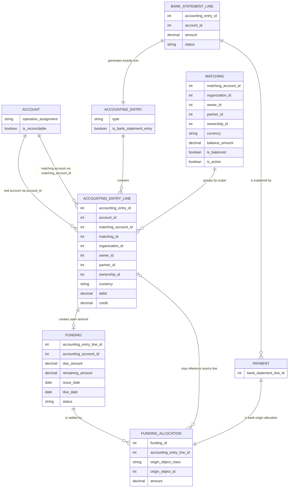
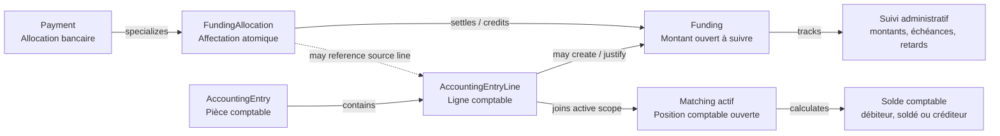
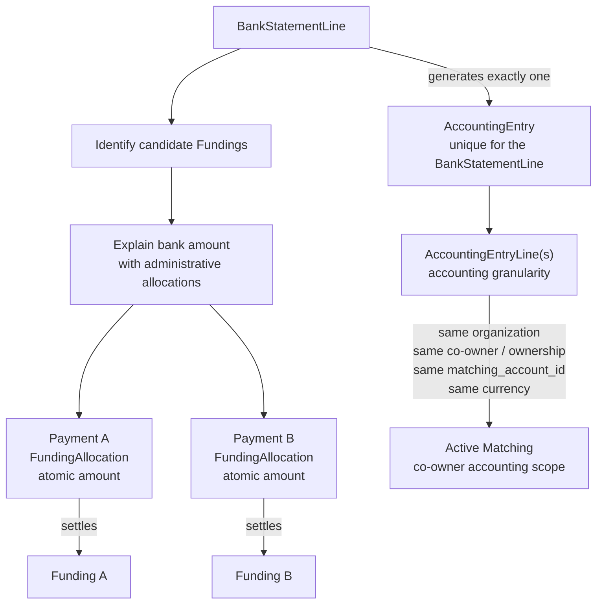
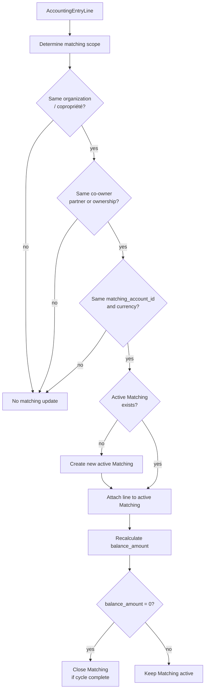

# Logique de réconciliation des paiements et du lettrage comptable

Le modèle repose sur une séparation stricte entre trois niveaux : 

* le suivi métier des montants ouverts, 
* l’affectation de montants à ces suivis, 
* et le lettrage comptable des lignes d’écriture. 

Cette séparation évite de créer deux vérités concurrentes entre la logique métier de rapprochement et la logique comptable de lettrage.

Le principe directeur est le suivant : le `Funding` porte le suivi administratif et métier des montants dus, attendus ou crédités ; le `FundingAllocation` et le `Payment` expliquent administrativement comment une source d’apurement est affectée à ces `Funding` ; le `Matching` porte le lettrage comptable des `AccountingEntryLine` dans un périmètre donné.

Ces niveaux doivent rester cohérents, mais ils ne portent pas nécessairement la même granularité. Un paiement peut être affecté administrativement à plusieurs `Funding`, tandis que la comptabilité peut conserver une ligne agrégée qui rejoint un `Matching` actif plus large. Le `Matching` ne doit donc pas être présenté comme la projection stricte et systématique d’une `FundingAllocation` vers la ligne source d’un `Funding`.

En résumé :

```text
Funding = suivi administratif des montants dus, attendus ou crédités
FundingAllocation = explication administrative d’un montant affecté à un Funding
Payment = FundingAllocation issue d’une ligne d’extrait bancaire
Matching = position comptable ouverte d’un périmètre de lettrage
AccountingEntryLine = ligne comptable qui rejoint un Matching selon son périmètre
```

## Vue d’ensemble des concepts

| Niveau            | Objet principal                    | Question traitée                                             |
| ----------------- | ---------------------------------- | ------------------------------------------------------------ |
| Métier            | `Funding`                          | Quel montant est dû, attendu, à justifier, à compenser ou à conserver ? |
| Affectation       | `FundingAllocation`                | Quel montant est affecté à quel `Funding`, et depuis quelle origine ? |
| Paiement bancaire | `Payment`                          | Quelle affectation provient d’une ligne d’extrait bancaire ? |
| Comptable         | `Matching` / `AccountingEntryLine` | Quelles lignes comptables composent la position comptable ouverte ? |

| Notion                  | Objet concerné                              | Sens                                                         |
| ----------------------- | ------------------------------------------- | ------------------------------------------------------------ |
| Montant ouvert          | `Funding`                                   | Montant dû, attendu, disponible, à compenser ou à conserver. |
| Affectation             | `FundingAllocation`                         | Montant atomique appliqué à un `Funding`.                    |
| Paiement bancaire       | `Payment`                                   | `FundingAllocation` dont l’origine est une `BankStatementLine`. |
| Lettrage comptable      | `AccountingEntryLine` + `Matching`          | Regroupement comptable de lignes d’écriture dans un périmètre de matching. |
| Réconciliation bancaire | `BankStatementLine` + `Payment` + `Funding` | Explication d’un mouvement bancaire par un ou plusieurs montants ouverts. |
| Compte réconciliable    | `Account.is_reconcilable`                   | Compte dont les écritures doivent être suivies pour pouvoir être rapprochées avec des lignes d’extrait bancaire via des `Funding`. |

## Vocabulaire : Allocation, FundingAllocation et Payment

Le terme **Allocation** est utilisé comme terme fonctionnel générique dans la documentation. Il désigne l’affectation atomique d’un montant à un `Funding`.

Dans le modèle technique, une allocation est représentée par un `FundingAllocation`. Lorsqu’elle provient d’une ligne d’extrait bancaire, ce `FundingAllocation` est spécialisé sous forme de `Payment`.

La convention documentaire est donc :

```text
Allocation = terme fonctionnel générique
FundingAllocation = entité technique générique d’affectation
Payment = spécialisation de FundingAllocation issue d’une BankStatementLine
```

Autrement dit :

```text
Payment ⊂ FundingAllocation
Allocation = FundingAllocation ou Payment, selon le contexte fonctionnel
```

Lorsque la distinction entre origine bancaire et origine non bancaire n’est pas nécessaire, la documentation peut parler simplement d’`Allocation`.

## Comptes réconciliables

Un compte est réconciliable lorsque les écritures postées sur ce compte doivent être suivies pour pouvoir être rapprochées avec des lignes d’extrait bancaire via des `Funding`.

Dans `Account`, cette information est portée par le champ calculé `is_reconcilable` :

```php
'is_reconcilable' => [
    'type'              => 'computed',
    'result_type'       => 'boolean',
    'description'       => "Indicates whether entries posted on this account are expected to be reconciled with bank statement lines through funding records.",
    'function'          => 'calcIsReconcilable',
    'store'             => true
]
```

Le calcul repose sur `operation_assignment` :

```php
protected static function calcIsReconcilable($self) {
    $result = [];
    $self->read(['operation_assignment']);
    foreach($self as $id => $account) {
        $result[$id] = false;
        if($account['operation_assignment']) {
            $result[$id] = in_array($account['operation_assignment'], [
                    'bank_transfer',
                    'suppliers_supplier',
                    'co_owners_owner',
                    'co_owners_owner_reserve_fund',
                    'co_owners_owner_working_fund'
                ], true);
        }
    }
    return $result;
}
```

Les comptes concernés sont donc notamment :

- les comptes de transfert bancaire ;
- les comptes fournisseurs ;
- les comptes copropriétaires ;
- les comptes copropriétaires liés au fonds de réserve ;
- les comptes copropriétaires liés au fonds de roulement.

Le champ `is_reconcilable` ne signifie pas seulement que les lignes peuvent être lettrées comptablement. Il signifie que les écritures du compte doivent être suivies via des `Funding` pour permettre une réconciliation bancaire correcte.

## Account, account_id et matching_account_id

La classe `AccountingEntryLine` dispose notamment des champs suivants :

```text
account_id
matching_account_id
matching_id
```

Ces champs ont des rôles distincts.

`account_id` représente le compte comptable réel de la ligne d’écriture. C’est le compte effectivement imputé dans la comptabilité.

`matching_account_id` représente le compte logique utilisé pour le rapprochement et le lettrage. C’est sur ce compte que le système vérifie si deux lignes peuvent être rapprochées dans un même `Matching`.

`matching_id` représente le groupe de lettrage comptable auquel la ligne appartient.

Dans le cas général :

```text
AccountingEntryLine.matching_account_id = AccountingEntryLine.account_id
```

Dans certains cas, notamment pour les copropriétaires, ces deux valeurs peuvent différer.

## Cas particulier des copropriétaires

Le cas des comptes copropriétaires est particulier.

Les écritures peuvent être imputées sur des comptes spécialisés, par exemple :

```text
co_owners_owner_reserve_fund
co_owners_owner_working_fund
```

Ces comptes sont réconciliables parce que les écritures qui les concernent doivent entrer dans le suivi métier. En revanche, pour la logique de réconciliation et de lettrage, le système centralise le suivi sur le compte collecteur :

```text
co_owners_owner
```

La règle est donc :

```text
Pour les copropriétaires :
Funding.accounting_account_id = compte collecteur co_owners_owner
AccountingEntryLine.matching_account_id = compte collecteur co_owners_owner
```

Le `account_id` réel de la ligne reste celui de l’imputation comptable effective. Le `matching_account_id`, lui, permet de lettrer ensemble des lignes qui appartiennent au même périmètre logique de copropriétaire, même si leurs comptes comptables réels sont différents.

Cette règle permet notamment de rapprocher des paiements reçus sur le compte collecteur avec des montants ouverts provenant du fonds de réserve ou du fonds de roulement.

## Rôle du Funding

Le `Funding` représente le niveau administratif et métier du modèle.

Il sert notamment à :

- suivre les montants dus, attendus ou crédités ;
- gérer les échéances ;
- suivre les retards de paiement ;
- fournir une base éventuelle pour les rappels et les frais de retard ;
- affecter logiquement un paiement ou une autre source d’apurement à une dette ou à un montant ouvert.

Le `Funding` porte donc la granularité métier : appels de fonds, soldes d’ouverture, factures, crédits résiduels, trop-payés ou montants à conserver. Cette granularité peut être plus fine que la granularité comptable retenue dans le `Matching`.

Il peut représenter :

- un montant à recevoir ;
- un montant à payer ;
- un appel de fonds ;
- une facture fournisseur ;
- un solde d’ouverture ;
- un trop-payé ;
- un paiement anticipé ;
- un crédit disponible ;
- une dette résiduelle ;
- une correction ;
- une opération diverse ;
- un transfert entre comptes ;
- un montant résiduel issu d’une ligne d’extrait bancaire.

Un `Funding` doit toujours être rattaché à une origine comptable identifiable. Il ne doit pas être un objet purement métier déconnecté de la comptabilité.

Dans le cas standard, cette origine est portée par :

```text
Funding.accounting_entry_line_id
```

Ce champ référence la ligne comptable qui crée le montant ouvert à suivre.

Exemple :

```text
Facture fournisseur
    → AccountingEntryLine fournisseur
        → Funding
```

Autre exemple :

```text
Appel de fonds copropriétaire
    → AccountingEntryLine copropriétaire
        → Funding
```

La règle structurante est donc :

```text
Funding.accounting_entry_line_id = ligne comptable qui crée le montant ouvert à suivre
```

Cette origine comptable est un lien de traçabilité. Elle ne signifie pas que le `Matching` doit être créé à la même granularité que le `Funding`, ni que toute allocation sur ce `Funding` doit être ajoutée telle quelle au `Matching` de cette ligne source.

Une `AccountingEntryLine` sur un compte réconciliable doit toujours être analysée. Elle ne crée toutefois pas nécessairement un nouveau `Funding` indépendant. Elle peut créer un `Funding`, apurer un `Funding` existant, compenser un `Funding` de sens inverse, générer un solde résiduel, provoquer une réaffectation d’allocations existantes ou rejoindre un `Matching` actif du même périmètre comptable.

## Rôle du FundingAllocation

`FundingAllocation` est l’objet générique d’affectation d’un montant à un `Funding`.

Il représente :

```text
un montant positif ou négatif appliqué à un Funding
```

Un `FundingAllocation` peut provenir de plusieurs types d’origines :

- ligne d’extrait bancaire ;
- opération diverse ;
- facture fournisseur ;
- appel de fonds ;
- décompte ;
- correction ;
- compensation ;
- solde d’ouverture ;
- autre `Funding` de sens inverse.

L’origine fonctionnelle est identifiée via :

```text
origin_object_class
origin_object_id
```

La ligne comptable source de l’affectation est identifiée via :

```text
FundingAllocation.accounting_entry_line_id
```

Ce champ n’a pas le même sens que `Funding.accounting_entry_line_id`.

Dans `Funding`, `accounting_entry_line_id` désigne la ligne qui crée le montant ouvert.

Dans `FundingAllocation`, `accounting_entry_line_id` désigne la ligne qui apporte le montant affecté au `Funding`.

La règle est donc :

```text
FundingAllocation.accounting_entry_line_id = ligne comptable source du montant affecté
```

## Atomicité administrative des allocations

Un `FundingAllocation`, et donc aussi un `Payment`, reste atomique au niveau administratif.

Cela signifie qu’il correspond à un seul montant affecté à un seul `Funding`. Cette règle permet d’expliquer précisément comment une dette, un appel de fonds, un solde d’ouverture ou un crédit résiduel est apuré.

Cette atomicité administrative ne doit pas être confondue avec la granularité comptable. Une ou plusieurs allocations peuvent s’appuyer sur une même ligne comptable source lorsque la comptabilité est enregistrée à un niveau agrégé. Réciproquement, une ligne comptable peut rejoindre un `Matching` actif qui regroupe plusieurs `Funding` du même périmètre.

La cardinalité cible est donc :

```text
1 FundingAllocation → 1 Funding
1 Payment → 1 origine bancaire
1 AccountingEntryLine → 1 Matching actif du périmètre, si la ligne est lettrable
```

Il ne faut pas en déduire :

```text
1 FundingAllocation → 1 Matching
FundingAllocation.amount → ajout obligatoire tel quel dans le Matching du Funding
```

Dans le flux de réconciliation bancaire, lorsqu’un paiement bancaire est ventilé sur plusieurs `Funding`, le système peut créer plusieurs `Payment` ou `FundingAllocation` pour expliquer l’affectation administrative. Cela n’impose pas de découper la ligne comptable bancaire au même niveau si la position comptable est suivie dans un `Matching` plus large.

Exemple :

```text
Ligne bancaire : 1 000 €
Funding A : 400 €
Funding B : 350 €
Funding C : 250 €
```

Résultat administratif :

```text
Payment A : 400 € → Funding A
Payment B : 350 € → Funding B
Payment C : 250 € → Funding C
```

Résultat comptable possible :

```text
AccountingEntryLine bancaire : -1 000 €
    → rejoint le Matching actif du périmètre
```

Selon les règles d’écriture retenues, ces allocations peuvent aussi être représentées par plusieurs lignes comptables. Le point structurant est que cette décision relève de la granularité comptable, pas de l’existence des `FundingAllocation`.

## 10. Rôle du Payment

Un `Payment` est un cas particulier de `FundingAllocation`.

Il correspond à une affectation provenant d’un mouvement externe d’argent, c’est-à-dire d’une `BankStatementLine`.

Dans le modèle :

```text
Payment hérite de FundingAllocation
Payment utilise la même table que FundingAllocation
```

Un `Payment` est identifié par exemple par :

```text
origin_object_class = 'finance\bank\BankStatementLine'
origin_object_id = bank_statement_line_id
```

La règle est :

```text
Tous les Payment sont des FundingAllocation.
Toutes les FundingAllocation ne sont pas des Payment.
```

Cela permet de conserver le vocabulaire métier `Payment` pour les mouvements bancaires sans appeler “paiement” des allocations issues d’OD, de corrections, de compensations ou de soldes d’ouverture.

## Rôle de BankStatementLine

Une `BankStatementLine` représente une ligne d’extrait bancaire.

Elle a un rôle particulier, car elle est à la fois :

1. un mouvement bancaire à expliquer ;
2. une origine de `Payment` ;
3. une pièce comptable générant une écriture ;
4. une source potentielle de `Funding` résiduel.

La cardinalité structurante est :

```text
1 BankStatementLine → 1 AccountingEntry
```

Une `BankStatementLine` génère toujours une seule `AccountingEntry`.

En revanche, cette `AccountingEntry` peut contenir plusieurs `AccountingEntryLine`, y compris plusieurs lignes pour un même compte comptable. Cela peut se produire lorsque le montant bancaire est réparti entre plusieurs `Funding`, sans imposer ce découpage lorsque la comptabilité reste agrégée.

Le flux de traitement est :

```text
1. La BankStatementLine est analysée.
2. Le système identifie les Funding candidats.
3. Le montant bancaire est ventilé sur ces Funding.
4. Les Payment ou FundingAllocation expliquent l’affectation administrative.
5. La BankStatementLine génère l’AccountingEntry comptable.
6. Les AccountingEntryLine générées rejoignent le Matching actif de leur périmètre comptable.
```

## Découpage bancaire

Le découpage bancaire ne se fait pas directement au niveau du `Matching`. Il se fait d’abord au niveau métier, sur base des `Funding` candidats.

Pour une ligne bancaire donnée, le système identifie les `Funding` ouverts pouvant être apurés. Il calcule ensuite, pour chaque `Funding`, le montant pouvant lui être affecté. Cette ventilation respecte les règles applicables, notamment la priorité chronologique FIFO lorsqu’elle s’applique.

Chaque part calculée peut donner lieu à un `Payment` ou à une `FundingAllocation` distincte pour conserver l’explication administrative de l’affectation.

Cette ventilation ne force pas le même découpage au niveau comptable. L’unique `AccountingEntry` générée par la `BankStatementLine` peut contenir une ligne agrégée par compte et périmètre de matching, ou plusieurs lignes si les règles comptables l’exigent.

Exemple :

```text
BankStatementLine : +2 500 €
AccountingEntry : écriture unique générée pour la ligne bancaire

Funding A : 1 000 €
Funding B :   900 €
Funding C :   600 €
```

Résultat administratif :

```text
Payment A : 1 000 € → Funding A
Payment B :   900 € → Funding B
Payment C :   600 € → Funding C
```

Résultat comptable possible :

```text
AccountingEntryLine bancaire : -2 500 €
    → rejoint le Matching actif du périmètre
```

Si la comptabilité exige trois lignes, elles peuvent toutes appartenir à la même `AccountingEntry` et rejoindre le même `Matching` dès lors qu’elles partagent le même périmètre.

## Rôle du Matching

Le `Matching` représente le niveau comptable du modèle.

Il sert notamment à :

- lettrer des `AccountingEntryLine` ;
- regrouper les lignes comptables d’un même périmètre ;
- calculer le solde comptable ouvert ;
- identifier une position débitrice, soldée ou créditrice.

Il ne porte pas la décision métier d’affectation. Cette décision appartient aux `Funding`, aux `FundingAllocation` et aux `Payment`.

Le `Matching` ne doit pas être compris comme une projection stricte d’une `FundingAllocation` vers la ligne comptable source d’un `Funding`. Il agrège les `AccountingEntryLine` pertinentes selon un périmètre de matching.

La relation conceptuelle cible est :

```text
AccountingEntryLine
    → identification du périmètre comptable
    → Matching actif du périmètre

Funding / FundingAllocation / Payment
    → explication administrative des montants ouverts et apurés
```

Un `Matching` est balancé lorsque les lignes comptables qu’il regroupe s’annulent :

```text
somme débit = somme crédit
```

ou :

```text
balance_amount = 0
```

S’il reste un solde, le `Matching` représente la position comptable ouverte du périmètre.

Le `Matching` ne doit pas être manipulé arbitrairement par l’utilisateur. Si une correction est nécessaire, elle doit être faite au niveau de la cause métier ou comptable : `Funding`, `FundingAllocation`, `Payment`, ligne bancaire, pièce source, OD ou imputation comptable. Le `Matching` est ensuite recalculé ou ajusté.

## Matching actif par copropriétaire

Pour les copropriétaires, l’approche cible est d’avoir au maximum un `Matching` actif par périmètre comptable.

Le périmètre est défini au minimum par :

- `organization_id` ou copropriété ;
- `owner_id`, `partner_id` ou `ownership_id` selon le modèle disponible ;
- `matching_account_id` ;
- `currency`.

Ce `Matching` représente la position comptable ouverte du copropriétaire dans ce périmètre.

Il peut regrouper :

- soldes d’ouverture ;
- appels de fonds ;
- paiements ;
- corrections ;
- opérations diverses ;
- trop-payés ;
- crédits résiduels.

Cette approche permet de conserver la granularité administrative sur les `Funding`, tout en regroupant la granularité comptable dans une position ouverte plus large.

## Interprétation du solde du Matching

Dans un `Matching` actif par copropriétaire, le signe du solde a un sens comptable :

```text
balance_amount > 0 : le copropriétaire est débiteur
balance_amount = 0 : la position comptable est soldée
balance_amount < 0 : le copropriétaire est créditeur
```

Une inversion de signe ne constitue donc pas nécessairement une erreur. Elle peut représenter une situation comptable normale, par exemple un trop-payé ou un crédit résiduel disponible.

## Cycle de vie du Matching actif

La logique cible n’est pas de créer un `Matching` par `Funding`.

Le cycle est le suivant :

```text
1. Il existe au maximum un Matching actif par copropriétaire et par périmètre.
2. Une nouvelle AccountingEntryLine rejoint le Matching actif si elle appartient au même périmètre.
3. Si aucun Matching actif n’existe, un nouveau Matching actif est créé.
4. Lorsque balance_amount revient à zéro, le Matching peut être clôturé.
5. Au prochain mouvement du même périmètre, un nouveau Matching actif est créé.
```

Cette règle évite deux écueils :

- créer un `Matching` atomique pour chaque `Funding` ou chaque `FundingAllocation` ;
- conserver un `Matching` éternel qui grossirait indéfiniment.

## Création et tentative de Matching

La tentative de matching est faite à partir d’une `AccountingEntryLine` lettrable.

Le flux est :

```text
AccountingEntryLine
    → identifier organization / copropriété
    → identifier copropriétaire, partner ou ownership
    → identifier matching_account_id
    → identifier currency
    → rechercher le Matching actif du périmètre
    → créer un Matching actif si nécessaire
    → rattacher la ligne au Matching
    → recalculer balance_amount
```

Les `FundingAllocation` et `Payment` peuvent aider à expliquer pourquoi la ligne existe ou comment elle est affectée administrativement, mais ils ne déterminent pas seuls le `Matching`. Le rattachement comptable dépend du périmètre de la `AccountingEntryLine`.

## Conditions de compatibilité pour le Matching

Deux `AccountingEntryLine` ne peuvent être regroupées dans un même `Matching` que si elles partagent le même périmètre comptable.

La règle n’est donc pas :

```text
les deux lignes doivent avoir le même account_id
```

mais bien :

```text
les deux lignes doivent avoir le même matching_account_id
```

Cette distinction est essentielle pour les copropriétaires. Une ligne peut être imputée sur un compte réel de fonds de réserve ou de fonds de roulement, tout en étant lettrée via le compte collecteur `co_owners_owner`.

Les règles de compatibilité à conserver sont :

```text
1. Même matching_account_id.
2. Même copropriété / organisation.
3. Même copropriétaire, partner ou ownership selon le modèle disponible.
4. Même devise.
5. Ligne source différente.
6. Ligne pas déjà rattachée au même Matching.
```

Les règles suivantes doivent être supprimées ou limitées aux cas où le modèle fonctionnel exige explicitement un matching strict par dette :

```text
interdire systématiquement l’inversion de signe du Matching
exiger que chaque ajout réduise uniquement le solde sans le dépasser
dépendre strictement de Funding.accounting_entry_line_id pour choisir le Matching
```

Dans le modèle cible par copropriétaire, une ligne peut faire passer le solde de positif à négatif. Ce basculement signifie que la position comptable devient créditrice.

Exemple :

```text
Matching actif : +1 000
Ligne source   : -1 200
Résultat       : -200
→ accepté, le copropriétaire devient créditeur de 200
```

L’atomicité administrative des allocations reste utile pour expliquer les `Funding` apurés, mais elle ne doit pas forcer une bijection entre `FundingAllocation` et `Matching`.

## Exemple copropriétaire avec trop-payé

```text
Solde d’ouverture : 2 300 €
Appel de fonds    :   500 €
Paiement bancaire : 3 000 €
```

Ancienne logique à éviter :

```text
Matching ouverture : +2 300
Matching appel     :   +500
Paiement découpé   : -2 500 + -500
Résultat           : impossibilité de matcher -2 500 avec +2 300
Conséquence        : deux Matchings non balancés et incohérents
```

Nouvelle logique cible :

```text
Matching actif copropriétaire
    Ligne d’ouverture : +2 300
    Ligne d’appel     :   +500
    Ligne de paiement : -3 000

Solde du Matching : -200
Interprétation    : copropriétaire créditeur de 200 €
```

Le `Funding` reste utilisé pour déterminer administrativement que :

- le solde d’ouverture de 2 300 € est payé ;
- l’appel de fonds de 500 € est payé ;
- le surplus de 200 € constitue un trop-payé ou un crédit disponible.

## Paiements partiels

Un `Payment` peut être partiel par rapport au `Funding` qu’il apure.

Exemple :

```text
Funding : 1 000 €
Payment :   400 €
```

Résultat :

```text
Funding restant ouvert : 600 €
Position comptable     : solde encore débiteur de 600 € si aucun autre mouvement n’existe dans le périmètre
```

Il ne faut pas confondre :

- une ligne bancaire entièrement expliquée ;
- un `Funding` partiellement soldé ;
- une position comptable ouverte dans le `Matching`.

Une `BankStatementLine` de 400 € peut être entièrement rapprochée au niveau bancaire même si elle ne solde qu’une partie d’un `Funding` de 1 000 €.

## Paiements groupés

Une ligne bancaire peut apurer plusieurs `Funding`.

Exemple :

```text
Ligne bancaire : 2 500 €
Funding A      : 1 000 €
Funding B      :   900 €
Funding C      :   600 €
```

Résultat administratif :

```text
Payment A : 1 000 € → Funding A
Payment B :   900 € → Funding B
Payment C :   600 € → Funding C
```

Chaque `Payment` est atomique au niveau administratif et correspond à un seul `Funding`.

La relation n-à-n entre une source bancaire et plusieurs `Funding` est portée par les `Payment` ou `FundingAllocation`, pas par une manipulation manuelle du `Matching`. La ou les `AccountingEntryLine` issues du paiement rejoignent ensuite le `Matching` actif selon leur périmètre.

## Trop-payés, paiements anticipés et résiduels

Lorsqu’un paiement dépasse les montants ouverts applicables, le solde ne doit pas être perdu ni seulement marqué comme anomalie.

Il peut générer un `Funding` créditeur résiduel, à condition que le tiers et le périmètre métier soient suffisamment identifiés.

Exemple :

```text
Montant dû    :   800 €
Paiement reçu : 1 000 €
```

Résultat :

```text
Payment sur Funding dû      : 800 €
Funding créditeur résiduel  : 200 €
Matching actif              : solde éventuellement créditeur selon les autres lignes du périmètre
```

Ce `Funding` créditeur pourra être utilisé plus tard pour apurer un nouveau `Funding` débiteur, en respectant les règles d’affectation applicables.

Si le tiers ou le périmètre ne sont pas identifiés, la ligne bancaire peut rester en attente de qualification ou être traitée selon une procédure d’imputation temporaire.

## Paiement arrivé avant le Funding

Une ligne bancaire peut arriver avant la pièce qui crée le montant dû.

Dans ce cas, le paiement peut créer un `Funding` créditeur ou rester en attente selon le niveau d’identification disponible.

Lorsqu’un nouveau `Funding` débiteur est créé plus tard, le système doit rechercher les crédits disponibles ou les allocations réutilisables pouvant l’apurer.

La logique fonctionne donc dans les deux sens :

```text
BankStatementLine → recherche de Funding existants
Funding créé → recherche de sources d’apurement existantes
```

Le fait qu’un `Funding` soit nouveau ne lui donne aucune priorité. Les règles d’affectation, notamment FIFO, restent applicables.

## Compensation entre Funding de sens inverse

Un `Funding` de sens inverse peut servir à apurer un autre `Funding`.

Cela concerne notamment :

- trop-payés ;
- crédits disponibles ;
- notes de crédit ;
- OD correctives ;
- transferts ;
- remboursements ;
- soldes résiduels.

La compensation se matérialise par un `FundingAllocation`.

La compensation doit être traitée comme une affectation normale : elle est soumise aux mêmes contraintes d’ordre, de traçabilité et d’atomicité administrative que les paiements bancaires. Son effet comptable est porté par les `AccountingEntryLine`, qui rejoignent le `Matching` actif de leur périmètre.

Exemple :

```text
Funding débiteur : 500 €
Funding créditeur : 200 €
```

Résultat :

```text
FundingAllocation de 200 € sur le Funding débiteur
Funding débiteur restant : 300 €
Funding créditeur soldé : 0 €
```

Si le crédit est supérieur à la dette :

```text
Funding débiteur : 500 €
Funding créditeur : 700 €
```

Résultat :

```text
FundingAllocation de 500 € sur le Funding débiteur
Funding débiteur soldé
Funding créditeur résiduel : 200 €
```

## Règle FIFO pour les copropriétaires

Pour les copropriétaires, l’affectation doit respecter une règle d’ancienneté.

La règle est :

```text
Un paiement reçu d’un copropriétaire doit être affecté aux Funding ouverts les plus anciens dans le périmètre applicable.
```

Cette règle vaut pour toutes les sources d’apurement :

- paiements bancaires ;
- trop-payés ;
- crédits disponibles ;
- OD créditrices ;
- corrections ;
- compensations entre `Funding`.

En pratique, les `Funding` de copropriétaire sont portés par le compte collecteur `co_owners_owner`. Le `Matching` utilise également ce compte collecteur via `matching_account_id`, mais il peut regrouper plusieurs `Funding` du même copropriétaire et du même périmètre.

Le périmètre exact de la file FIFO doit rester cohérent avec les règles métier applicables à l’ownership, à la copropriété et au type de montant suivi. Lorsque plusieurs comptes économiques sont ramenés au même compte collecteur, le système doit conserver l’information d’origine via la `AccountingEntryLine` source afin de pouvoir expliquer le fonds concerné.

## Réaffectation et découpe des allocations

Lorsqu’un nouveau `Funding` est créé, ou lorsqu’un `Funding` ancien est modifié ou réactivé, il peut être nécessaire de réaffecter des allocations existantes.

Cela peut impliquer :

- transférer une allocation d’un `Funding` récent vers un `Funding` plus ancien ;
- découper une allocation existante ;
- invalider une allocation existante ;
- créer plusieurs nouvelles allocations atomiques ;
- recalculer les soldes administratifs ;
- recalculer ou ajuster les `Matching` concernés à partir des lignes comptables.

Exemple :

```text
Allocation existante : 500 € affectés à Funding B récent
Funding A plus ancien reste ouvert pour 300 €
```

Résultat attendu :

```text
Allocation 1 : 300 € vers Funding A
Allocation 2 : 200 € vers Funding B
```

Une allocation est atomique. Si une affectation doit être répartie, elle doit être découpée en plusieurs allocations atomiques.

## Traitement d’une AccountingEntryLine

Lorsqu’une `AccountingEntryLine` est créée sur un compte réconciliable, le système doit analyser son effet.

Elle peut :

1. créer un nouveau `Funding` ;
2. apurer un `Funding` existant via un `FundingAllocation` ;
3. compenser un `Funding` de sens inverse ;
4. générer un `Funding` résiduel ;
5. provoquer une réaffectation d’allocations existantes ;
6. rejoindre le `Matching` actif de son périmètre comptable.

La séquence logique n’est donc pas simplement :

```text
AccountingEntryLine → Funding
```

mais plutôt :

```text
AccountingEntryLine
    → analyse du compte, du tiers, du périmètre et du sens
    → analyse de la position ouverte existante
    → création ou apurement de Funding
    → création éventuelle de FundingAllocation
    → rattachement au Matching actif du périmètre comptable
```

## Ordre logique de traitement d’une ligne bancaire

Pour une `BankStatementLine`, l’ordre logique cible est :

```text
1. Identifier le mouvement bancaire et son compte.
2. Identifier le tiers ou le périmètre métier lorsque c’est possible.
3. Rechercher les Funding candidats.
4. Classer les Funding selon les règles applicables, notamment FIFO.
5. Calculer le montant atomique affectable à chaque Funding.
6. Créer les Payment ou FundingAllocation nécessaires pour expliquer l’affectation administrative.
7. Générer l’unique AccountingEntry de la BankStatementLine.
8. Générer les AccountingEntryLine selon la granularité comptable retenue.
9. Associer les Payment ou FundingAllocation à leur origine et, si disponible, à la ligne comptable source.
10. Rattacher les AccountingEntryLine lettrables au Matching actif de leur périmètre.
11. Calculer le résiduel éventuel.
12. Créer un Funding résiduel si nécessaire.
13. Mettre à jour le statut de rapprochement de la BankStatementLine.
14. Historiser le traitement.
```

L’ordre réel peut varier selon les contraintes d’implémentation, notamment si l’écriture comptable doit exister avant la création des `Payment`. La contrainte fonctionnelle reste toutefois : chaque `Payment` doit expliquer une affectation administrative traçable. Il ne doit pas nécessairement correspondre à une `AccountingEntryLine` distincte.

## Ordre logique de traitement d’une pièce comptable classique

Pour une pièce comptable non bancaire, l’ordre logique est :

```text
1. Générer l’écriture comptable.
2. Identifier les AccountingEntryLine sur comptes réconciliables.
3. Pour chaque ligne suivie :
   - analyser le compte, le tiers, le périmètre et le sens ;
   - rechercher les Funding ouverts applicables ;
   - créer un Funding si nécessaire ;
   - ou apurer un Funding existant ;
   - ou compenser un Funding de sens inverse ;
   - ou créer un résiduel.
4. Créer ou ajuster les FundingAllocation correspondantes.
5. Rattacher les AccountingEntryLine lettrables au Matching actif de leur périmètre.
6. Mettre à jour les statuts.
7. Historiser les changements.
```

## OD et corrections

Une opération diverse qui impacte un compte réconciliable doit être analysée comme toute autre source comptable.

Elle peut :

- créer un `Funding` ;
- apurer un `Funding` existant ;
- compenser un `Funding` inverse ;
- générer un résiduel ;
- modifier la situation d’un tiers ;
- provoquer une réaffectation d’allocations existantes.

Une OD sur un compte suivi n’est donc pas un cas spécial hors modèle. Elle entre dans la même logique `Funding` / `FundingAllocation` / `Matching`.

## Opening balance

Les soldes d’ouverture doivent être traités comme une origine comptable identifiable.

Un `Funding` provenant d’une opening balance doit être lié à une ligne comptable d’ouverture identifiable.

Cela permet ensuite de générer des `FundingAllocation` cohérents lorsque ce solde est apuré, et de faire rejoindre la ligne d’ouverture au `Matching` actif du périmètre comptable.

À défaut, le système risquerait de matcher un paiement avec une autre écriture uniquement parce que le montant correspond.

## Conservation des Funding échus

Un `Funding` dont la `due_date` est dépassée ne doit pas être supprimé physiquement.

Il peut être :

- soldé ;
- compensé ;
- annulé logiquement ;
- corrigé ;
- remplacé ;
- neutralisé par une allocation inverse.

Mais il doit rester conservé pour l’historique.

Après échéance, toute correction doit passer par une opération traçable, jamais par une suppression physique du `Funding`.

## Statuts de rapprochement

Les lignes bancaires peuvent avoir un statut de rapprochement distinct du statut comptable.

| Statut             | Signification                                                |
| ------------------ | ------------------------------------------------------------ |
| `pending`          | Aucun rapprochement `Funding` n’a encore été effectué, ou le montant reste à analyser. |
| `partial` / `part` | Une partie seulement du montant est expliquée.               |
| `full`             | L’intégralité du montant bancaire est expliquée.             |
| `not_applicable`   | La ligne n’est pas soumise à rapprochement.                  |

L’état cible d’une ligne bancaire traitée est :

```text
status = posted
```

Cela signifie que la ligne est comptabilisée et entièrement expliquée au niveau métier.

Cela ne signifie pas nécessairement que tous les `Funding` concernés sont soldés. Une ligne bancaire peut être entièrement expliquée tout en ne soldant qu’une partie d’un `Funding` plus important.

Cela ne signifie pas non plus que l’utilisateur a manipulé directement un `Matching`. Le `Matching`, lorsqu’il existe, est dérivé automatiquement.

## Annulation, modification et recalcul

Si une écriture, un `Funding`, un `Payment` ou un `FundingAllocation` est modifié ou annulé, les conséquences doivent être recalculées.

Cela peut impliquer :

- annulation logique d’un `Funding` ;
- réouverture d’un `Funding` ;
- invalidation d’un `Payment` ;
- invalidation d’un `FundingAllocation` ;
- découpe d’une allocation ;
- réaffectation d’une allocation ;
- création de nouvelles allocations atomiques ;
- recalcul d’un delta ;
- création d’un nouveau `Funding` résiduel ;
- recalcul ou ajustement des `Matching`.

La logique doit être réversible, idempotente et historisée.

### Annulation d’une pièce comptable source

Lorsqu’une pièce comptable est annulée, les `Funding` générés par cette pièce sont supprimés. Les `Payment` et `FundingAllocation` qui s’y rapportent sont également supprimés, sauf lorsqu’ils matérialisent un mouvement bancaire déjà identifié par une `BankStatementLine`.

Pour une allocation bancaire rattachée à une `AccountingEntryLine` de la pièce annulée, la ligne d’extrait devient la nouvelle origine fonctionnelle à conserver :

1. l’allocation est détachée de l’`AccountingEntryLine` annulée ;
2. le système appelle `BankStatementLine::assert_funding` pour garantir un `Funding` de type `statement_line` sur la ligne d’extrait ;
3. l’allocation est rattachée à ce `Funding` de ligne d’extrait ;
4. les `Funding` impactés sont recalculés.

Cette règle maintient la traçabilité du mouvement bancaire tout en supprimant les liens vers la pièce et les écritures annulées. Une annulation de pièce ne doit donc jamais laisser une allocation pointant vers une `AccountingEntryLine` neutralisée.

Le système doit pouvoir expliquer :

- quel événement a déclenché le recalcul ;
- quels `Funding` ont été modifiés ;
- quelles allocations ont été créées, invalidées, découpées ou ajustées ;
- quelles lignes comptables ont été créées ou invalidées ;
- quels `Matching` ont été recalculés ;
- quel était l’état avant et après.

Pour les écritures encore modifiables, le recalcul peut remplacer les lignes dérivées. Pour les écritures verrouillées ou publiées, les corrections doivent respecter les contraintes comptables applicables, par exemple via annulation logique, extourne ou OD corrective.

## Idempotence et traçabilité

Les traitements doivent être idempotents : un second appel ne doit pas créer de doublons.

Exemples :

- une même `AccountingEntryLine` ne doit pas créer deux fois le même `Funding` ;
- une même allocation ne doit pas générer de doublon comptable ;
- une même `AccountingEntryLine` ne doit pas être ajoutée plusieurs fois au même `Matching` ;
- un recalcul doit pouvoir remplacer proprement ou invalider l’état précédent.

La traçabilité administrative est portée par :

- `Funding` ;
- `FundingAllocation` ;
- `Payment` ;
- `origin_object_class` ;
- `origin_object_id`.

La traçabilité comptable est portée par :

- `AccountingEntry` ;
- `AccountingEntryLine` ;
- `Matching` ;
- `matching_account_id` ;
- le périmètre de matching.

Les deux niveaux doivent rester cohérents, mais ils ne doivent pas être confondus.

Les liens de traçabilité principaux sont :

Pour `Funding` :

```text
Funding.accounting_entry_line_id
Funding.source_object_class
Funding.source_object_id
Funding.accounting_account_id
```

Pour `FundingAllocation` :

```text
FundingAllocation.funding_id
FundingAllocation.accounting_entry_line_id
FundingAllocation.origin_object_class
FundingAllocation.origin_object_id
FundingAllocation.amount
```

Pour `Payment` :

```text
Payment = FundingAllocation
origin_object_class = 'finance\bank\BankStatementLine'
origin_object_id = bank_statement_line_id
accounting_entry_line_id = ligne comptable source ou associée, si disponible
```

Pour `Matching` :

```text
Matching.matching_account_id ou matching account de référence
Matching.organization_id / copropriété
Matching.owner_id, partner_id ou ownership_id selon le modèle disponible
Matching.currency
AccountingEntryLine.matching_id
AccountingEntryLine.matching_account_id
```

Le `Matching` peut regrouper plusieurs lignes comptables et plusieurs mouvements administratifs. Les justifications métier restent portées par les `Funding`, `FundingAllocation` et `Payment`.

## Diagramme de modèle de données



## Diagramme synthétique de la logique métier



## Diagramme du découpage bancaire



## Diagramme de tentative de Matching



## Synthèse finale

```text
Funding = suivi administratif des dettes, échéances, retards, frais et affectations métier.

FundingAllocation / Payment = explication administrative d’un paiement ou d’une source d’apurement par rapport aux Funding.

Matching = position comptable ouverte d’un copropriétaire dans un périmètre donné, regroupant les AccountingEntryLine pertinentes.
```

Il ne faut pas forcer une bijection stricte entre `FundingAllocation` et `Matching`.

