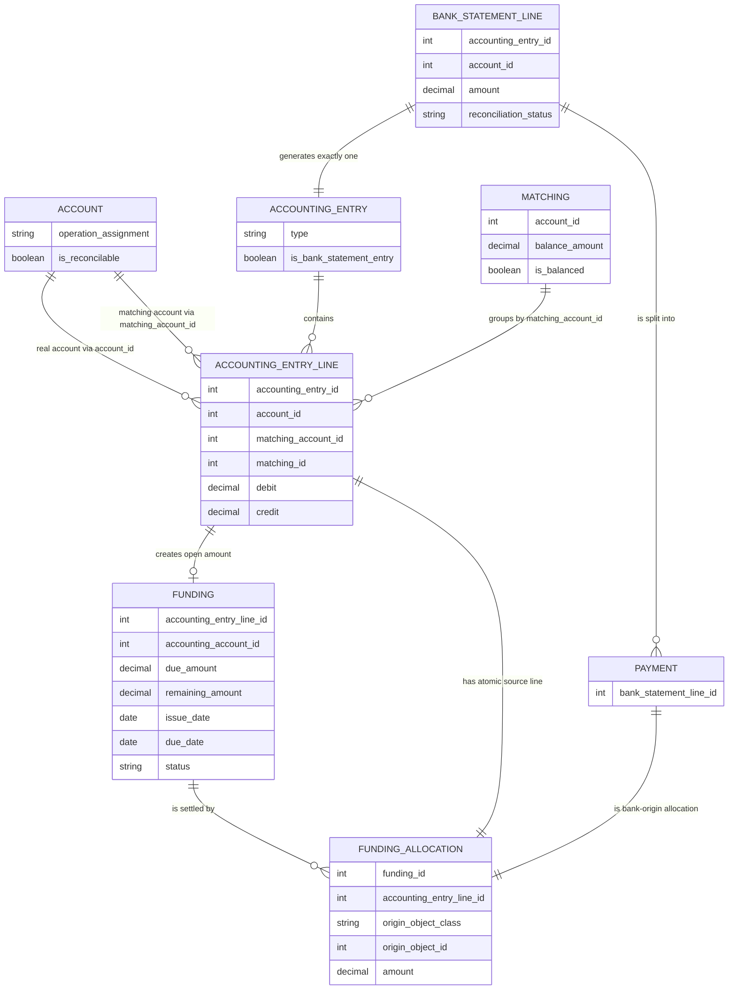
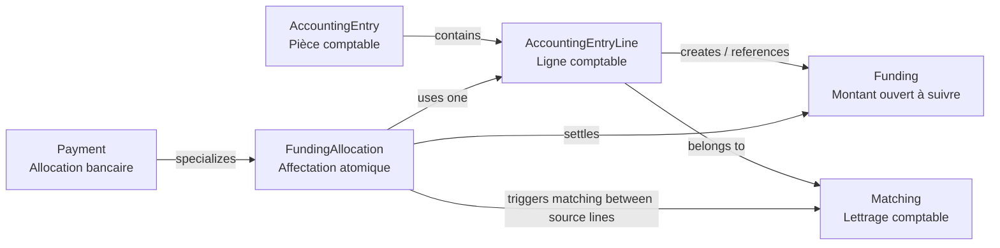
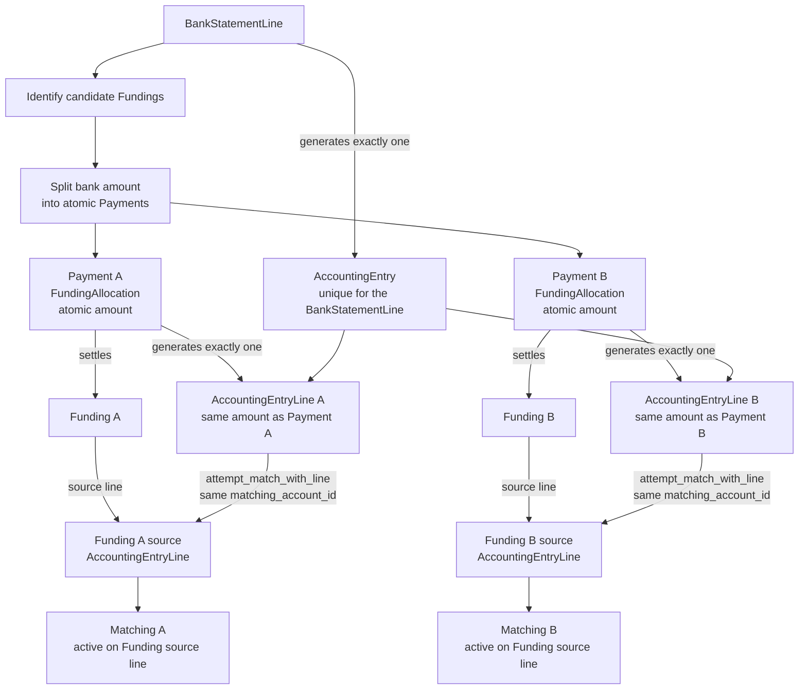
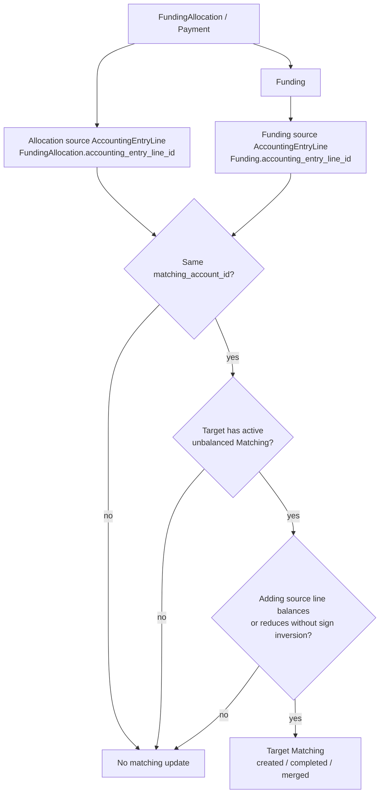

# Logique de réconciliation des paiements et du lettrage comptable

Le modèle repose sur une séparation stricte entre trois niveaux : 

* le suivi métier des montants ouverts, 
* l’affectation de montants à ces suivis, 
* et le lettrage comptable des lignes d’écriture. 

Cette séparation évite de créer deux vérités concurrentes entre la logique métier de rapprochement et la logique comptable de lettrage.

Le principe directeur est le suivant : le `Funding` porte la vérité métier du montant ouvert à suivre ; le `FundingAllocation` porte l’affectation ou l’apurement de ce montant ; le `Payment` est un `FundingAllocation` particulier issu d’un mouvement bancaire ; le `Matching` est la projection comptable automatique de cette affectation entre les lignes comptables concernées.

En résumé :

```text
Funding = montant ouvert à suivre
FundingAllocation = montant affecté à un Funding
Payment = FundingAllocation issue d’une ligne d’extrait bancaire
Matching = projection comptable automatique d’une affectation
AccountingEntryLine = ligne comptable source du Funding ou de l’affectation
```

## Vue d’ensemble des concepts

| Niveau            | Objet principal                    | Question traitée                                             |
| ----------------- | ---------------------------------- | ------------------------------------------------------------ |
| Métier            | `Funding`                          | Quel montant est dû, attendu, à justifier, à compenser ou à conserver ? |
| Affectation       | `FundingAllocation`                | Quel montant est affecté à quel `Funding`, et depuis quelle origine ? |
| Paiement bancaire | `Payment`                          | Quelle affectation provient d’une ligne d’extrait bancaire ? |
| Comptable         | `Matching` / `AccountingEntryLine` | Quelles lignes comptables sont liées entre elles par cette affectation ? |

| Notion                  | Objet concerné                              | Sens                                                         |
| ----------------------- | ------------------------------------------- | ------------------------------------------------------------ |
| Montant ouvert          | `Funding`                                   | Montant dû, attendu, disponible, à compenser ou à conserver. |
| Affectation             | `FundingAllocation`                         | Montant atomique appliqué à un `Funding`.                    |
| Paiement bancaire       | `Payment`                                   | `FundingAllocation` dont l’origine est une `BankStatementLine`. |
| Lettrage comptable      | `AccountingEntryLine` + `Matching`          | Rapprochement comptable entre lignes d’écriture.             |
| Réconciliation bancaire | `BankStatementLine` + `Payment` + `Funding` | Explication d’un mouvement bancaire par un ou plusieurs montants ouverts. |
| Compte réconciliable    | `Account.is_reconcilable`                   | Compte dont les écritures doivent être suivies pour pouvoir être rapprochées avec des lignes d’extrait bancaire via des `Funding`. |

## Vocabulaire : Allocation, FundingAllocation et Payment

Le terme **Allocation** est utilisé comme terme fonctionnel générique dans la documentation. Il désigne l’affectation atomique d’un montant à un `Funding`.

Dans le modèle technique, une allocation est représentée par un `FundingAllocation`. Lorsqu’elle provient d’une ligne d’extrait bancaire, ce `FundingAllocation` est spécialisé sous forme de `Payment`.

La convention documentaire est donc :

```text
Allocation = terme fonctionnel générique
FundingAllocation = entité technique générique d’affectation
Payment = spécialisation de FundingAllocation issue d’une BankStatementLine
```

Autrement dit :

```text
Payment ⊂ FundingAllocation
Allocation = FundingAllocation ou Payment, selon le contexte fonctionnel
```

Lorsque la distinction entre origine bancaire et origine non bancaire n’est pas nécessaire, la documentation peut parler simplement d’`Allocation`.

## Comptes réconciliables

Un compte est réconciliable lorsque les écritures postées sur ce compte doivent être suivies pour pouvoir être rapprochées avec des lignes d’extrait bancaire via des `Funding`.

Dans `Account`, cette information est portée par le champ calculé `is_reconcilable` :

```php
'is_reconcilable' => [
    'type'              => 'computed',
    'result_type'       => 'boolean',
    'description'       => "Indicates whether entries posted on this account are expected to be reconciled with bank statement lines through funding records.",
    'function'          => 'calcIsReconcilable',
    'store'             => true
]
```

Le calcul repose sur `operation_assignment` :

```php
protected static function calcIsReconcilable($self) {
    $result = [];
    $self->read(['operation_assignment']);
    foreach($self as $id => $account) {
        $result[$id] = false;
        if($account['operation_assignment']) {
            $result[$id] = in_array($account['operation_assignment'], [
                    'bank_transfer',
                    'suppliers_supplier',
                    'co_owners_owner',
                    'co_owners_owner_reserve_fund',
                    'co_owners_owner_working_fund'
                ], true);
        }
    }
    return $result;
}
```

Les comptes concernés sont donc notamment :

- les comptes de transfert bancaire ;
- les comptes fournisseurs ;
- les comptes copropriétaires ;
- les comptes copropriétaires liés au fonds de réserve ;
- les comptes copropriétaires liés au fonds de roulement.

Le champ `is_reconcilable` ne signifie pas seulement que les lignes peuvent être lettrées comptablement. Il signifie que les écritures du compte doivent être suivies via des `Funding` pour permettre une réconciliation bancaire correcte.

## Account, account_id et matching_account_id

La classe `AccountingEntryLine` dispose notamment des champs suivants :

```text
account_id
matching_account_id
matching_id
```

Ces champs ont des rôles distincts.

`account_id` représente le compte comptable réel de la ligne d’écriture. C’est le compte effectivement imputé dans la comptabilité.

`matching_account_id` représente le compte logique utilisé pour le rapprochement et le lettrage. C’est sur ce compte que le système vérifie si deux lignes peuvent être rapprochées dans un même `Matching`.

`matching_id` représente le groupe de lettrage comptable auquel la ligne appartient.

Dans le cas général :

```text
AccountingEntryLine.matching_account_id = AccountingEntryLine.account_id
```

Dans certains cas, notamment pour les copropriétaires, ces deux valeurs peuvent différer.

## Cas particulier des copropriétaires

Le cas des comptes copropriétaires est particulier.

Les écritures peuvent être imputées sur des comptes spécialisés, par exemple :

```text
co_owners_owner_reserve_fund
co_owners_owner_working_fund
```

Ces comptes sont réconciliables parce que les écritures qui les concernent doivent entrer dans le suivi métier. En revanche, pour la logique de réconciliation et de lettrage, le système centralise le suivi sur le compte collecteur :

```text
co_owners_owner
```

La règle est donc :

```text
Pour les copropriétaires :
Funding.accounting_account_id = compte collecteur co_owners_owner
AccountingEntryLine.matching_account_id = compte collecteur co_owners_owner
```

Le `account_id` réel de la ligne reste celui de l’imputation comptable effective. Le `matching_account_id`, lui, permet de lettrer ensemble des lignes qui appartiennent au même périmètre logique de copropriétaire, même si leurs comptes comptables réels sont différents.

Cette règle permet notamment de rapprocher des paiements reçus sur le compte collecteur avec des montants ouverts provenant du fonds de réserve ou du fonds de roulement.

## Rôle du Funding

Le `Funding` représente un montant ouvert à suivre.

Il peut représenter :

- un montant à recevoir ;
- un montant à payer ;
- un appel de fonds ;
- une facture fournisseur ;
- un solde d’ouverture ;
- un trop-payé ;
- un paiement anticipé ;
- un crédit disponible ;
- une dette résiduelle ;
- une correction ;
- une opération diverse ;
- un transfert entre comptes ;
- un montant résiduel issu d’une ligne d’extrait bancaire.

Un `Funding` doit toujours être rattaché à une origine comptable identifiable. Il ne doit pas être un objet purement métier déconnecté de la comptabilité.

Dans le cas standard, cette origine est portée par :

```text
Funding.accounting_entry_line_id
```

Ce champ référence la ligne comptable qui crée le montant ouvert à suivre.

Exemple :

```text
Facture fournisseur
    → AccountingEntryLine fournisseur
        → Funding
```

Autre exemple :

```text
Appel de fonds copropriétaire
    → AccountingEntryLine copropriétaire
        → Funding
```

La règle structurante est donc :

```text
Funding.accounting_entry_line_id = ligne comptable qui crée le montant ouvert à suivre
```

Une `AccountingEntryLine` sur un compte réconciliable doit toujours être analysée. Elle ne crée toutefois pas nécessairement un nouveau `Funding` indépendant. Elle peut créer un `Funding`, apurer un `Funding` existant, compenser un `Funding` de sens inverse, générer un solde résiduel ou provoquer une réaffectation d’allocations existantes.

## Rôle du FundingAllocation

`FundingAllocation` est l’objet générique d’affectation d’un montant à un `Funding`.

Il représente :

```text
un montant positif ou négatif appliqué à un Funding
```

Un `FundingAllocation` peut provenir de plusieurs types d’origines :

- ligne d’extrait bancaire ;
- opération diverse ;
- facture fournisseur ;
- appel de fonds ;
- décompte ;
- correction ;
- compensation ;
- solde d’ouverture ;
- autre `Funding` de sens inverse.

L’origine fonctionnelle est identifiée via :

```text
origin_object_class
origin_object_id
```

La ligne comptable source de l’affectation est identifiée via :

```text
FundingAllocation.accounting_entry_line_id
```

Ce champ n’a pas le même sens que `Funding.accounting_entry_line_id`.

Dans `Funding`, `accounting_entry_line_id` désigne la ligne qui crée le montant ouvert.

Dans `FundingAllocation`, `accounting_entry_line_id` désigne la ligne qui apporte le montant affecté au `Funding`.

La règle est donc :

```text
FundingAllocation.accounting_entry_line_id = ligne comptable source du montant affecté
```

## Atomicité des allocations

Un `FundingAllocation`, et donc aussi un `Payment`, est toujours atomique.

Cela signifie qu’il correspond à un seul montant affecté à un seul `Funding`, et qu’il doit correspondre exactement au montant de la `AccountingEntryLine` qu’il réconcilie.

La cardinalité cible est :

```text
1 FundingAllocation → 1 AccountingEntryLine
1 Payment → 1 AccountingEntryLine
```

Il ne peut donc pas y avoir plusieurs `AccountingEntryLine` pour un même `Payment`.

Réciproquement, dans le flux de réconciliation bancaire, lorsqu’un paiement bancaire est ventilé sur plusieurs `Funding`, le système crée plusieurs `Payment`, chacun avec sa propre ligne comptable.

Exemple :

```text
Ligne bancaire : 1 000 €
Funding A : 400 €
Funding B : 350 €
Funding C : 250 €
```

Résultat :

```text
Payment A : 400 € → AccountingEntryLine A : 400 €
Payment B : 350 € → AccountingEntryLine B : 350 €
Payment C : 250 € → AccountingEntryLine C : 250 €
```

Ces trois lignes comptables peuvent appartenir à la même `AccountingEntry` de la ligne bancaire.

## 10. Rôle du Payment

Un `Payment` est un cas particulier de `FundingAllocation`.

Il correspond à une affectation provenant d’un mouvement externe d’argent, c’est-à-dire d’une `BankStatementLine`.

Dans le modèle :

```text
Payment hérite de FundingAllocation
Payment utilise la même table que FundingAllocation
```

Un `Payment` est identifié par exemple par :

```text
origin_object_class = 'finance\bank\BankStatementLine'
origin_object_id = bank_statement_line_id
```

La règle est :

```text
Tous les Payment sont des FundingAllocation.
Toutes les FundingAllocation ne sont pas des Payment.
```

Cela permet de conserver le vocabulaire métier `Payment` pour les mouvements bancaires sans appeler “paiement” des allocations issues d’OD, de corrections, de compensations ou de soldes d’ouverture.

## Rôle de BankStatementLine

Une `BankStatementLine` représente une ligne d’extrait bancaire.

Elle a un rôle particulier, car elle est à la fois :

1. un mouvement bancaire à expliquer ;
2. une origine de `Payment` ;
3. une pièce comptable générant une écriture ;
4. une source potentielle de `Funding` résiduel.

La cardinalité structurante est :

```text
1 BankStatementLine → 1 AccountingEntry
```

Une `BankStatementLine` génère toujours une seule `AccountingEntry`.

En revanche, cette `AccountingEntry` peut contenir plusieurs `AccountingEntryLine`, y compris plusieurs lignes pour un même compte comptable. Cela se produit lorsque le montant bancaire est réparti entre plusieurs `Funding`.

Le flux de traitement est :

```text
1. La BankStatementLine est analysée.
2. Le système identifie les Funding candidats.
3. Le montant bancaire est ventilé sur ces Funding.
4. Un Payment atomique est créé pour chaque montant affecté.
5. Chaque Payment génère une AccountingEntryLine correspondante.
6. Toutes ces AccountingEntryLine appartiennent à l’unique AccountingEntry de la BankStatementLine.
```

## Découpage bancaire

Le découpage bancaire ne se fait pas directement au niveau du `Matching`. Il se fait d’abord au niveau métier, sur base des `Funding` candidats.

Pour une ligne bancaire donnée, le système identifie les `Funding` ouverts pouvant être apurés. Il calcule ensuite, pour chaque `Funding`, le montant pouvant lui être affecté. Cette ventilation respecte les règles applicables, notamment la priorité chronologique FIFO lorsqu’elle s’applique.

Chaque part calculée donne lieu à un `Payment` distinct.

Chaque `Payment` donne lieu à une `AccountingEntryLine` distincte.

Il peut donc y avoir plusieurs `AccountingEntryLine` pour un même compte comptable au sein de l’unique `AccountingEntry` générée par la `BankStatementLine`.

Exemple :

```text
BankStatementLine : +2 500 €
AccountingEntry : écriture unique générée pour la ligne bancaire

Funding A : 1 000 €
Funding B :   900 €
Funding C :   600 €
```

Résultat :

```text
Payment A : 1 000 € → AccountingEntryLine A
Payment B :   900 € → AccountingEntryLine B
Payment C :   600 € → AccountingEntryLine C
```

Les trois lignes appartiennent à la même `AccountingEntry`.

## Rôle du Matching

Le `Matching` est une structure comptable de lettrage.

Il ne porte pas la décision métier d’affectation. Cette décision appartient aux `Funding` et aux `FundingAllocation`.

Le `Matching` est la projection comptable automatique de cette décision.

Il relie la ligne comptable source du `Funding` avec la ligne comptable source de l’allocation.

La relation conceptuelle est :

```text
Funding.accounting_entry_line_id
FundingAllocation.accounting_entry_line_id
FundingAllocation.amount
    ↓
Matching
```

Un `Matching` est balancé lorsque les lignes comptables qu’il regroupe s’annulent :

```text
somme débit = somme crédit
```

ou :

```text
balance_amount = 0
```

S’il reste un solde, le `Matching` représente un lettrage partiel.

Le `Matching` ne doit pas être manipulé arbitrairement par l’utilisateur. Si une correction est nécessaire, elle doit être faite au niveau de la cause métier ou comptable : `Funding`, `FundingAllocation`, `Payment`, ligne bancaire, pièce source, OD ou imputation comptable. Le `Matching` est ensuite recalculé ou ajusté.

## Création et tentative de Matching

La tentative de matching est faite entre :

- la `AccountingEntryLine` source du `Funding` à apurer ;
- la `AccountingEntryLine` créée ou utilisée par le `Payment` ou le `FundingAllocation`.

Le flux est :

```text
Payment / FundingAllocation
    → funding_id
        → Funding.accounting_entry_line_id
    → accounting_entry_line_id
        → AccountingEntryLine source de l’allocation

Puis :
AccountingEntryLine source de l’allocation
    → attempt_match_with_line(Funding.accounting_entry_line_id)
```

La méthode `attempt_match_with_line` ne crée pas un `Matching` depuis rien. Elle suppose que la ligne cible, c’est-à-dire la ligne source du `Funding`, possède déjà un `matching_id` actif.

Si la ligne cible n’a pas de `matching_id`, la tentative ne fait rien.

Si le `Matching` cible est déjà balancé, la tentative ne fait rien.

Cela implique que les lignes comptables éligibles au lettrage doivent recevoir un `Matching` potentiel dès leur création ou dans une étape préparatoire.

## Conditions de compatibilité pour le Matching

Deux `AccountingEntryLine` ne peuvent être rapprochées que si elles partagent le même `matching_account_id`.

La règle n’est donc pas :

```text
les deux lignes doivent avoir le même account_id
```

mais bien :

```text
les deux lignes doivent avoir le même matching_account_id
```

Cette distinction est essentielle pour les copropriétaires. Une ligne peut être imputée sur un compte réel de fonds de réserve ou de fonds de roulement, tout en étant lettrée via le compte collecteur `co_owners_owner`.

La tentative de matching applique les règles suivantes :

```text
1. La ligne cible doit exister.
2. La ligne cible doit avoir un matching_id.
3. Le Matching cible ne doit pas déjà être balancé.
4. La ligne source et la ligne cible doivent avoir le même matching_account_id.
5. La ligne source ne doit pas être la ligne cible.
6. La ligne source ne doit pas déjà appartenir au même Matching.
7. L’ajout de la ligne source doit équilibrer le Matching ou réduire son solde sans en inverser le signe.
```

Si l’ajout de la ligne source ferait basculer le solde du `Matching` de l’autre côté, la ligne n’est pas ajoutée. Dans ce cas, le montant aurait dû être découpé en amont au niveau des `Payment` ou `FundingAllocation`.

Exemple accepté :

```text
Matching cible : +1 000
Ligne source   : -400
Résultat       : +600
→ accepté, matching partiel
```

Exemple accepté :

```text
Matching cible : +1 000
Ligne source   : -1 000
Résultat       : 0
→ accepté, matching balancé
```

Exemple refusé :

```text
Matching cible : +1 000
Ligne source   : -1 200
Résultat       : -200
→ refusé, car le solde changerait de signe
```

Cette règle confirme l’importance de l’atomicité des allocations.

## Paiements partiels

Un `Payment` peut être partiel par rapport au `Funding` qu’il apure.

Exemple :

```text
Funding : 1 000 €
Payment :   400 €
```

Résultat :

```text
Funding restant ouvert : 600 €
Matching partiel       : 400 €
```

Il ne faut pas confondre :

- une ligne bancaire entièrement expliquée ;
- un `Funding` partiellement soldé ;
- un `Matching` partiel.

Une `BankStatementLine` de 400 € peut être entièrement rapprochée au niveau bancaire même si elle ne solde qu’une partie d’un `Funding` de 1 000 €.

## Paiements groupés

Une ligne bancaire peut apurer plusieurs `Funding`.

Exemple :

```text
Ligne bancaire : 2 500 €
Funding A      : 1 000 €
Funding B      :   900 €
Funding C      :   600 €
```

Résultat :

```text
Payment A : 1 000 €
Payment B :   900 €
Payment C :   600 €
```

Chaque `Payment` est atomique, correspond à un seul `Funding`, et génère une seule `AccountingEntryLine`.

La relation n-à-n entre une source bancaire et plusieurs `Funding` est donc portée par les `Payment`, pas par une manipulation manuelle du `Matching`.

## Trop-payés, paiements anticipés et résiduels

Lorsqu’un paiement dépasse les montants ouverts applicables, le solde ne doit pas être perdu ni seulement marqué comme anomalie.

Il peut générer un `Funding` créditeur résiduel, à condition que le tiers et le périmètre métier soient suffisamment identifiés.

Exemple :

```text
Montant dû    :   800 €
Paiement reçu : 1 000 €
```

Résultat :

```text
Payment sur Funding dû      : 800 €
Funding créditeur résiduel  : 200 €
```

Ce `Funding` créditeur pourra être utilisé plus tard pour apurer un nouveau `Funding` débiteur, en respectant les règles d’affectation applicables.

Si le tiers ou le périmètre ne sont pas identifiés, la ligne bancaire peut rester en attente de qualification ou être traitée selon une procédure d’imputation temporaire.

## Paiement arrivé avant le Funding

Une ligne bancaire peut arriver avant la pièce qui crée le montant dû.

Dans ce cas, le paiement peut créer un `Funding` créditeur ou rester en attente selon le niveau d’identification disponible.

Lorsqu’un nouveau `Funding` débiteur est créé plus tard, le système doit rechercher les crédits disponibles ou les allocations réutilisables pouvant l’apurer.

La logique fonctionne donc dans les deux sens :

```text
BankStatementLine → recherche de Funding existants
Funding créé → recherche de sources d’apurement existantes
```

Le fait qu’un `Funding` soit nouveau ne lui donne aucune priorité. Les règles d’affectation, notamment FIFO, restent applicables.

## Compensation entre Funding de sens inverse

Un `Funding` de sens inverse peut servir à apurer un autre `Funding`.

Cela concerne notamment :

- trop-payés ;
- crédits disponibles ;
- notes de crédit ;
- OD correctives ;
- transferts ;
- remboursements ;
- soldes résiduels.

La compensation se matérialise par un `FundingAllocation`.

La compensation doit être traitée comme une affectation normale : elle est soumise aux mêmes contraintes d’ordre, de traçabilité, d’atomicité et de projection comptable que les paiements bancaires.

Exemple :

```text
Funding débiteur : 500 €
Funding créditeur : 200 €
```

Résultat :

```text
FundingAllocation de 200 € sur le Funding débiteur
Funding débiteur restant : 300 €
Funding créditeur soldé : 0 €
```

Si le crédit est supérieur à la dette :

```text
Funding débiteur : 500 €
Funding créditeur : 700 €
```

Résultat :

```text
FundingAllocation de 500 € sur le Funding débiteur
Funding débiteur soldé
Funding créditeur résiduel : 200 €
```

## Règle FIFO pour les copropriétaires

Pour les copropriétaires, l’affectation doit respecter une règle d’ancienneté.

La règle est :

```text
Un paiement reçu d’un copropriétaire doit être affecté aux Funding ouverts les plus anciens dans le périmètre applicable.
```

Cette règle vaut pour toutes les sources d’apurement :

- paiements bancaires ;
- trop-payés ;
- crédits disponibles ;
- OD créditrices ;
- corrections ;
- compensations entre `Funding`.

En pratique, les `Funding` de copropriétaire sont portés par le compte collecteur `co_owners_owner`. Le `Matching` utilise également ce compte collecteur via `matching_account_id`.

Le périmètre exact de la file FIFO doit rester cohérent avec les règles métier applicables à l’ownership, à la copropriété et au type de montant suivi. Lorsque plusieurs comptes économiques sont ramenés au même compte collecteur, le système doit conserver l’information d’origine via la `AccountingEntryLine` source afin de pouvoir expliquer le fonds concerné.

## Réaffectation et découpe des allocations

Lorsqu’un nouveau `Funding` est créé, ou lorsqu’un `Funding` ancien est modifié ou réactivé, il peut être nécessaire de réaffecter des allocations existantes.

Cela peut impliquer :

- transférer une allocation d’un `Funding` récent vers un `Funding` plus ancien ;
- découper une allocation existante ;
- invalider une allocation existante ;
- créer plusieurs nouvelles allocations atomiques ;
- recalculer les soldes ;
- régénérer ou ajuster les `Matching`.

Exemple :

```text
Allocation existante : 500 € affectés à Funding B récent
Funding A plus ancien reste ouvert pour 300 €
```

Résultat attendu :

```text
Allocation 1 : 300 € vers Funding A
Allocation 2 : 200 € vers Funding B
```

Une allocation est atomique. Si une affectation doit être répartie, elle doit être découpée en plusieurs allocations atomiques.

## Traitement d’une AccountingEntryLine

Lorsqu’une `AccountingEntryLine` est créée sur un compte réconciliable, le système doit analyser son effet.

Elle peut :

1. créer un nouveau `Funding` ;
2. apurer un `Funding` existant via un `FundingAllocation` ;
3. compenser un `Funding` de sens inverse ;
4. générer un `Funding` résiduel ;
5. provoquer une réaffectation d’allocations existantes ;
6. déclencher une tentative de `Matching`.

La séquence logique n’est donc pas simplement :

```text
AccountingEntryLine → Funding
```

mais plutôt :

```text
AccountingEntryLine
    → analyse du compte, du tiers, du périmètre et du sens
    → analyse de la position ouverte existante
    → création ou apurement de Funding
    → création éventuelle de FundingAllocation
    → tentative de Matching
```

## Ordre logique de traitement d’une ligne bancaire

Pour une `BankStatementLine`, l’ordre logique cible est :

```text
1. Identifier le mouvement bancaire et son compte.
2. Identifier le tiers ou le périmètre métier lorsque c’est possible.
3. Rechercher les Funding candidats.
4. Classer les Funding selon les règles applicables, notamment FIFO.
5. Calculer le montant atomique affectable à chaque Funding.
6. Créer un Payment pour chaque montant affecté.
7. Générer l’unique AccountingEntry de la BankStatementLine.
8. Générer une AccountingEntryLine par Payment.
9. Associer chaque Payment à sa AccountingEntryLine.
10. Pour chaque Payment, tenter le Matching avec la AccountingEntryLine source du Funding.
11. Calculer le résiduel éventuel.
12. Créer un Funding résiduel si nécessaire.
13. Mettre à jour le statut de rapprochement de la BankStatementLine.
14. Historiser le traitement.
```

L’ordre réel peut varier selon les contraintes d’implémentation, notamment si l’écriture comptable doit exister avant la création des `Payment`. La contrainte fonctionnelle reste toutefois : chaque `Payment` doit correspondre exactement à une `AccountingEntryLine`.

## Ordre logique de traitement d’une pièce comptable classique

Pour une pièce comptable non bancaire, l’ordre logique est :

```text
1. Générer l’écriture comptable.
2. Identifier les AccountingEntryLine sur comptes réconciliables.
3. Pour chaque ligne suivie :
   - analyser le compte, le tiers, le périmètre et le sens ;
   - rechercher les Funding ouverts applicables ;
   - créer un Funding si nécessaire ;
   - ou apurer un Funding existant ;
   - ou compenser un Funding de sens inverse ;
   - ou créer un résiduel.
4. Créer ou ajuster les FundingAllocation correspondantes.
5. Tenter les Matching.
6. Mettre à jour les statuts.
7. Historiser les changements.
```

## OD et corrections

Une opération diverse qui impacte un compte réconciliable doit être analysée comme toute autre source comptable.

Elle peut :

- créer un `Funding` ;
- apurer un `Funding` existant ;
- compenser un `Funding` inverse ;
- générer un résiduel ;
- modifier la situation d’un tiers ;
- provoquer une réaffectation d’allocations existantes.

Une OD sur un compte suivi n’est donc pas un cas spécial hors modèle. Elle entre dans la même logique `Funding` / `FundingAllocation` / `Matching`.

## Opening balance

Les soldes d’ouverture doivent être traités comme une origine comptable identifiable.

Un `Funding` provenant d’une opening balance doit être lié à une ligne comptable d’ouverture identifiable.

Cela permet ensuite de générer des `FundingAllocation` et des `Matching` cohérents lorsque ce solde est apuré.

À défaut, le système risquerait de matcher un paiement avec une autre écriture uniquement parce que le montant correspond.

## Conservation des Funding échus

Un `Funding` dont la `due_date` est dépassée ne doit pas être supprimé physiquement.

Il peut être :

- soldé ;
- compensé ;
- annulé logiquement ;
- corrigé ;
- remplacé ;
- neutralisé par une allocation inverse.

Mais il doit rester conservé pour l’historique.

Après échéance, toute correction doit passer par une opération traçable, jamais par une suppression physique du `Funding`.

## Statuts de rapprochement

Les lignes bancaires peuvent avoir un statut de rapprochement distinct du statut comptable.

| Statut             | Signification                                                |
| ------------------ | ------------------------------------------------------------ |
| `pending`          | Aucun rapprochement `Funding` n’a encore été effectué, ou le montant reste à analyser. |
| `partial` / `part` | Une partie seulement du montant est expliquée.               |
| `full`             | L’intégralité du montant bancaire est expliquée.             |
| `not_applicable`   | La ligne n’est pas soumise à rapprochement.                  |

L’état cible d’une ligne bancaire traitée est :

```text
status = posted
reconciliation_status = full
```

Cela signifie que la ligne est comptabilisée et entièrement expliquée au niveau métier.

Cela ne signifie pas nécessairement que tous les `Funding` concernés sont soldés. Une ligne bancaire peut être entièrement expliquée tout en ne soldant qu’une partie d’un `Funding` plus important.

Cela ne signifie pas non plus que l’utilisateur a manipulé directement un `Matching`. Le `Matching`, lorsqu’il existe, est dérivé automatiquement.

## Annulation, modification et recalcul

Si une écriture, un `Funding`, un `Payment` ou un `FundingAllocation` est modifié ou annulé, les conséquences doivent être recalculées.

Cela peut impliquer :

- annulation logique d’un `Funding` ;
- réouverture d’un `Funding` ;
- invalidation d’un `Payment` ;
- invalidation d’un `FundingAllocation` ;
- découpe d’une allocation ;
- réaffectation d’une allocation ;
- création de nouvelles allocations atomiques ;
- recalcul d’un delta ;
- création d’un nouveau `Funding` résiduel ;
- recalcul ou ajustement des `Matching`.

La logique doit être réversible, idempotente et historisée.

Le système doit pouvoir expliquer :

- quel événement a déclenché le recalcul ;
- quels `Funding` ont été modifiés ;
- quelles allocations ont été créées, invalidées, découpées ou ajustées ;
- quelles lignes comptables ont été créées ou invalidées ;
- quels `Matching` ont été recalculés ;
- quel était l’état avant et après.

Pour les écritures encore modifiables, le recalcul peut remplacer les lignes dérivées. Pour les écritures verrouillées ou publiées, les corrections doivent respecter les contraintes comptables applicables, par exemple via annulation logique, extourne ou OD corrective.

## Idempotence et traçabilité

Les traitements doivent être idempotents : un second appel ne doit pas créer de doublons.

Exemples :

- une même `AccountingEntryLine` ne doit pas créer deux fois le même `Funding` ;
- une même allocation ne doit pas générer deux fois la même ligne comptable ;
- une même allocation ne doit pas être projetée plusieurs fois dans le `Matching` ;
- un recalcul doit pouvoir remplacer proprement ou invalider l’état précédent.

Les liens de traçabilité principaux sont :

Pour `Funding` :

```text
Funding.accounting_entry_line_id
Funding.source_object_class
Funding.source_object_id
Funding.accounting_account_id
```

Pour `FundingAllocation` :

```text
FundingAllocation.funding_id
FundingAllocation.accounting_entry_line_id
FundingAllocation.origin_object_class
FundingAllocation.origin_object_id
FundingAllocation.amount
```

Pour `Payment` :

```text
Payment = FundingAllocation
origin_object_class = 'finance\bank\BankStatementLine'
origin_object_id = bank_statement_line_id
accounting_entry_line_id = ligne comptable générée pour ce Payment
```

Pour `Matching` :

```text
Matching.account_id ou matching account de référence
AccountingEntryLine.matching_id
AccountingEntryLine.matching_account_id
```

Le `Matching` peut regrouper plusieurs lignes comptables, mais les justifications métier restent portées par les `FundingAllocation` / `Payment`.

## Diagramme de modèle de données



## Diagramme synthétique de la logique métier



## Diagramme du découpage bancaire



## Diagramme de tentative de Matching



