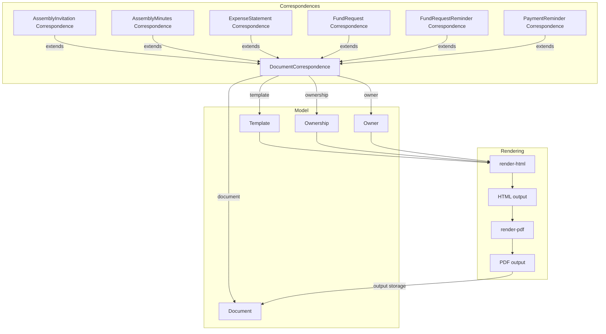
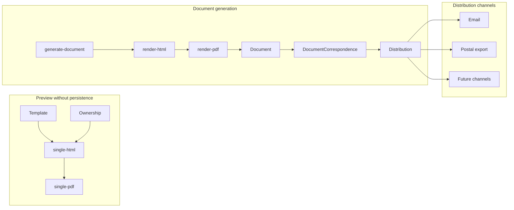

# Génération de documents et correspondances

## Objectif général

Le logiciel gère plusieurs types de documents formels liés à la gouvernance et à la gestion financière d’une copropriété. Bien que leur finalité juridique ou fonctionnelle diffère, ces documents reposent sur une logique commune de modélisation, de rendu, de génération, de stockage et de distribution.

Cette logique vise à séparer clairement plusieurs responsabilités : la définition métier du document, le rendu technique, la persistance, l’individualisation par destinataire et la diffusion. Cette séparation garantit la cohérence du système, facilite la traçabilité, permet la prévisualisation sans persistance, et rend possible l’extension future vers d’autres canaux de distribution.

Les principaux types de documents concernés sont notamment :

* `AssemblyInvitation` — convocation à l’assemblée générale ;
* `AssemblyMinutes` — procès-verbal d’assemblée générale ;
* `ExpenseStatement` — décompte de charges ;
* `FundRequest` — appel de fonds ;
* `FundRequestReminder` — rappel de paiement.

Cette logique s’applique ensuite à leurs correspondances individualisées, telles que `AssemblyInvitationCorrespondence`, `AssemblyMinutesCorrespondence`, `ExpenseStatementCorrespondence`, `FundRequestCorrespondence` et `FundRequestReminderCorrespondence`.

## Distinction entre preview, génération et export

La logique documentaire distingue trois opérations proches, mais fonctionnellement différentes.

La **preview** produit une représentation temporaire d’un document. Elle permet de vérifier un rendu ou de contrôler un template sans créer de `Document` persistant et sans créer de `DocumentCorrespondence`. Une preview peut porter sur un périmètre limité, par exemple quelques `Ownership`, afin d’obtenir rapidement un aperçu représentatif. Elle peut aussi être incomplète lorsque l’objet métier n’est pas encore dans un état définitif.

La **génération** produit un document réel. Elle aboutit à un PDF stocké dans un `Document` et, lorsqu’un destinataire est concerné, à une `DocumentCorrespondence`. La génération matérialise donc une trace persistante dans le EDMS.

L’**export** regroupe des documents ou des correspondances dans un output destiné à une opération de diffusion, d’impression ou d’archivage. Il ne définit pas le contenu fonctionnel du document ; il organise des documents déjà générés ou générables sous une forme exploitable, par exemple une archive `.zip` contenant un ou plusieurs PDF fusionnés.

| Opération | Persistance | Entités principales | Usage |
| --- | --- | --- | --- |
| Preview | Non | renderer temporaire, `Ownership`, éventuellement `Owner` | Contrôler un rendu avant émission |
| Génération | Oui | `Document`, `DocumentCorrespondence` | Créer le document destiné à un propriétaire ou destinataire |
| Export | Oui, pour le résultat d’export | `ExportingTask`, `ExportingTaskLine`, `Document` | Regrouper, fusionner ou archiver des documents pour diffusion |


## Structure conceptuelle

Le système distingue plusieurs niveaux qui correspondent à des réalités différentes. Ces niveaux ne doivent pas être confondus, même s’ils participent tous au cycle de vie documentaire.

### Document métier ou source documentaire

Le document métier représente la définition logique et fonctionnelle du document à produire. Il correspond à la pièce ou à la source du flux documentaire.

Il porte la finalité métier du document, sa portée fonctionnelle ou juridique, la structure attendue de son contenu, les règles de génération et, le cas échéant, les informations nécessaires à la gestion des versions ou des pièces jointes.

À ce stade, le document n’est pas encore lié à un destinataire précis et n’est pas nécessairement matérialisé par un fichier PDF stocké. Il s’agit d’abord d’un objet métier à partir duquel un rendu peut être produit.

Exemples : `AssemblyInvitation`, `AssemblyMinutes`, `ExpenseStatement`, `FundRequest`, `FundRequestReminder`.

### Rendu de document

Le rendu de document ne correspond pas encore à un document persistant. Il s’agit d’une représentation produite à partir d’un template et d’un contexte de rendu.

Le système utilise des renderers spécialisés. Par convention, un endpoint `render-html` produit une sortie HTML à partir du template et des données disponibles. Un endpoint `render-pdf` s’appuie ensuite sur le rendu HTML et convertit cette sortie en PDF, généralement via DomPDF.

Cette logique de rendu peut être utilisée dans deux situations distinctes.

La première est la prévisualisation. Le système produit alors une représentation théorique d’un document tel qu’il serait généré à cet instant, sans créer d’artefact persistant.

La seconde est la génération effective. Dans ce cas, un controller de génération, typiquement `generate-document`, appelle les renderers, produit le PDF final, le stocke dans un `Document` persistant, puis crée les correspondances nécessaires.

### Document persistant

Le `Document` correspond au stockage persistant d’un output généré, typiquement un PDF produit par `render-pdf`.

Il matérialise le résultat généré et peut ensuite être intégré à l’EDMS afin d’assurer sa conservation, sa traçabilité et sa consultation ultérieure.

Le `Document` stocké ne doit pas être confondu avec le document métier abstrait. Le premier est un artefact généré, tandis que le second est la source fonctionnelle ou métier à partir de laquelle le système sait produire un rendu.

### Émission globale du document

L’émission globale correspond à la décision formelle de produire un document à un moment donné et d’en organiser la diffusion vers un ensemble de destinataires.

Elle est datée, traçable, rattachée à un document métier, et indépendante du canal de distribution. Elle ne dépend donc pas du fait qu’un destinataire reçoive son document par email, par voie postale, via une archive papier ou, à terme, via un autre canal comme une eBox ou un portail sécurisé.

Cette étape peut être représentée conceptuellement par un `DocumentIssuance`, même si le nom exact de l’entité peut dépendre de l’implémentation retenue.

## Renderers HTML et PDF

La génération documentaire suit une chaîne simple : **HTML → PDF**.

Le renderer `render-html` produit le contenu HTML à partir du template et du contexte métier. Il concentre la logique de présentation, les données injectées dans le template et les variantes liées au contexte de rendu.

Le renderer `render-pdf` appelle généralement `render-html`, puis convertit le HTML en PDF. Le PDF est donc une matérialisation du rendu HTML, et non un second endroit où réimplémenter la logique métier du document.

Pour les documents liés à un seul `Ownership`, ou parfois à un seul `Owner`, des renderers spécifiques peuvent être exposés :

* `single-html` produit un rendu HTML temporaire pour un contexte individualisé ;
* `single-pdf` produit le PDF correspondant sans créer de `Document` persistant.

Ces renderers sont particulièrement utiles pour les previews. Ils permettent de visualiser une version proche du futur document sans déclencher l’émission complète. Ils peuvent aussi être utilisés comme base par les renderers des correspondances, afin que la preview et le document final reposent sur la même logique de rendu.

Une preview peut toutefois rester partielle. Lorsqu’un document implique plusieurs `Ownership`, le système peut limiter volontairement le rendu à un sous-ensemble représentatif. De même, si l’objet métier est encore en préparation, certaines données définitives peuvent manquer et le rendu ne doit pas être interprété comme une version juridiquement émise.


## Correspondence et DocumentCorrespondence

Le mécanisme des `Correspondence` permet de gérer la génération, le stockage et l’envoi de documents destinés aux propriétaires, en séparant le contexte métier, le rendu du document et sa diffusion.

Une correspondance représente une intention de communication liée à un contexte métier donné. Elle est associée à un `Template` et à un `Ownership`. Le `Template` définit la structure du contenu à produire, tandis que l’`Ownership` fournit le contexte de copropriété ou de propriété auquel la correspondance se rapporte.

Cette association au `Template` et à l’`Ownership` permet notamment de produire des aperçus ou des rendus sans dépendre immédiatement d’un destinataire final.

Une `DocumentCorrespondence` représente le document concret adressé à un destinataire donné, généralement un propriétaire. Elle constitue la correspondance formelle individualisée issue d’un processus de génération.

Elle est rattachée à trois éléments principaux :

* un `Document`, qui stocke l’output généré ;
* un `Ownership`, qui fournit le contexte métier de la correspondance ;
* un `Owner`, qui représente le destinataire effectif de la correspondance.

Cette structure permet de distinguer la phase de préparation ou de prévisualisation, qui peut fonctionner uniquement sur base de l’`Ownership`, de la phase de génération effective, qui implique un `Owner` identifié et un `Document` persisté.

Une `DocumentCorrespondence` est associée à un destinataire unique. Elle peut contenir un contenu entièrement spécifique au destinataire, par exemple dans le cas d’un décompte de charges ou d’un appel de fonds, ou un contenu commun avec une personnalisation limitée, comme l’adresse, l’en-tête ou les formules de politesse.

Les classes spécialisées héritent de cette logique commune. C’est le cas notamment de `AssemblyInvitationCorrespondence`, `AssemblyMinutesCorrespondence`, `ExpenseStatementCorrespondence`, `FundRequestCorrespondence`, `FundRequestExecutionCorrespondence` ou `PaymentReminderCorrespondence`.

## Prévisualisation sans persistance

Le système doit permettre de produire des previews de documents qui n’existent pas encore comme artefacts persistants.

Une preview peut être produite à partir d’un `Template` et d’un `Ownership`, sans que le `Owner` soit encore connu. Ce fonctionnement est utile pour vérifier le rendu général d’un courrier, contrôler la structure du template ou visualiser le contenu dans un contexte donné avant de générer les documents définitifs.

La preview reste donc une opération de rendu basée sur le contexte, et non une opération de communication vers un destinataire.

Un cas typique est le décompte de charges global au niveau de la copropriété. Ce document peut être consulté sous forme d’aperçu global, alors que la génération réelle produit en pratique autant de documents qu’il y a de copropriétaires concernés.

En phase de génération réelle, les `DocumentCorrespondence` portent normalement le rendu final via leurs endpoints `render-html` et `render-pdf`, car elles encapsulent le document généré, l’`Ownership` et le `Owner`. En phase de preview, ces correspondances n’existent pas encore.

Pour permettre un rendu immédiat, le système utilise donc des controllers de rendu temporaire. Ces renderers de type `single-html` ou `single-pdf` sont non persistants et peuvent être combinés à un controller de preview `render-pdf` pour obtenir un aperçu fidèle du futur document sans créer de `DocumentCorrespondence` ni stocker de PDF définitif.

Lorsqu’ils sont disponibles, les endpoints `single-html` acceptent notamment :

* `ownership_id` ;
* `owner_id`, optionnel.

Ces renderers peuvent ensuite être réutilisés par les `render-html` des correspondances associées, qui injectent explicitement ces informations afin de garantir la cohérence entre preview et rendu final.

## Génération effective et production des documents

La génération effective correspond au passage d’un document métier ou d’une intention de communication vers un ou plusieurs artefacts persistants.

Le processus consiste à identifier les destinataires concernés, généralement les `Owner` liés à un `Ownership` ou à un ensemble d’`Ownership`, puis à créer une `DocumentCorrespondence` pour chaque destinataire.

Pour chaque correspondance, le système génère le rendu HTML à partir du `Template` et du contexte de rendu, produit le PDF final via `render-pdf`, stocke cet output dans un `Document`, puis rattache ce `Document` à la `DocumentCorrespondence` concernée.

Le controller `generate-document` orchestre cette opération. Il appelle les renderers nécessaires, assure le stockage du résultat, et crée les objets de correspondance qui matérialisent les documents individuels adressés aux destinataires.

### Génération des correspondances

La génération d’une correspondance consiste à produire un document individualisé pour chaque destinataire.

La vocation d’une `DocumentCorrespondence` est donc double :

* relier le document généré au contexte métier, généralement un `Ownership` ;
* relier ce même document au destinataire effectif, généralement un `Owner`.

Dans le cas d’un document envoyé à plusieurs copropriétaires, le système ne stocke pas un unique PDF générique pour tous les destinataires. Il crée autant de correspondances que nécessaire afin que chaque destinataire dispose de son propre document, avec ses coordonnées, ses montants, ses annexes ou ses mentions personnalisées.

Cette individualisation reste valable même lorsque le contenu principal est largement commun. Une convocation peut partager le même ordre du jour pour tous les propriétaires, tout en nécessitant une adresse, une formule d’appel ou une annexe nominative différente. À l’inverse, un décompte ou un appel de fonds peut être entièrement propre à chaque propriétaire.


Le processus peut donc être résumé ainsi :

1. le document métier ou la correspondance définit la source fonctionnelle du rendu ;
2. le `Template` définit la forme du courrier ;
3. l’`Ownership` fournit le contexte métier ;
4. le `Owner` fournit le contexte destinataire lorsqu’un document individualisé est produit ;
5. `render-html` génère une sortie HTML ;
6. `render-pdf` transforme cette sortie en PDF ;
7. le PDF est stocké dans un `Document` ;
8. une `DocumentCorrespondence` relie le `Document`, l’`Ownership` et le `Owner` ;
9. le document est ensuite rendu consultable, envoyé ou intégré à un export selon les besoins.

## Canaux de distribution

Une `DocumentCorrespondence` peut être transmise via un canal de distribution déterminé par les préférences du destinataire.

Les canaux actuellement envisagés sont principalement :

* l’envoi par email ;
* l’envoi postal, via une production papier ou un export destiné à l’impression.

Le canal de distribution est une propriété de la `DocumentCorrespondence`. Il est optionnel et n’impacte ni le document métier abstrait, ni l’émission globale.

Cette approche permet de distinguer clairement l’existence d’une correspondance de son éventuelle transmission. Elle permet aussi de combiner plusieurs modes de distribution pour une même émission, de respecter les préférences individuelles des destinataires et d’envisager facilement de futurs canaux.

Une fois les documents générés et stockés, ils peuvent être diffusés en lot. Si le propriétaire accepte ou préfère la communication électronique, le document peut être envoyé par email. Si le propriétaire doit recevoir une version papier, le document peut être inclus dans un export, par exemple sous forme d’archive `.zip`, destinée à l’impression.

L’envoi par email et l’export postal ne doivent pas être confondus avec la génération du document.

Pour l’email, la règle fonctionnelle attendue est généralement : **une correspondance, un email, une pièce jointe**. L’email utilise le `Document` associé à la `DocumentCorrespondence` comme pièce jointe, et le suivi d’envoi appartient à la logique de distribution.

Pour l’envoi postal, l’objectif est différent. Il faut regrouper une série de correspondances afin de produire un ou plusieurs PDF prêts à imprimer. Ces regroupements peuvent être fusionnés et placés dans une archive `.zip`, produite de manière asynchrone par les exports de correspondances.

La génération crée les documents individuels. L’export organise ces documents pour une opération groupée.

## Lien avec les envois groupés

Les envois groupés par email sont documentés séparément dans [Envois et rappels](../../suivis/envois-et-rappels/envois-et-rappels.md).

Un `Broadcast` permet d’envoyer un même message email à plusieurs destinataires, avec éventuellement des documents EDMS en pièces jointes. Il ne doit pas être confondu avec la génération de `DocumentCorrespondence`, qui produit un document individualisé par destinataire.

## Variabilité du contenu

La variabilité du contenu est gérée au niveau de la `DocumentCorrespondence`.

Certains documents produisent des correspondances au contenu entièrement individualisé. C’est notamment le cas des décomptes de charges, des appels de fonds et des rappels de paiement, qui dépendent directement des montants, quotes-parts, soldes ou situations propres à chaque copropriétaire.

D’autres documents partagent un contenu largement identique entre destinataires, avec une personnalisation limitée à des informations comme l’adresse, l’en-tête, la formule d’appel ou certaines mentions propres au destinataire.

Cette distinction permet de conserver des templates réutilisables tout en injectant les données spécifiques via le contexte de rendu.

## Organisation des templates de rendu

Les templates de rendu sont organisés selon leur contexte d’utilisation.

Le contexte `stand-alone` correspond au rendu autonome d’un document. Il est utilisé pour la prévisualisation, la génération globale ou l’archive.

Le contexte `correspondence` correspond au rendu utilisé dans le cadre d’une `DocumentCorrespondence`, avec personnalisation du destinataire.

| Contexte       | Template                | Entité concernée                    | Remarques                                            |
| -------------- | ----------------------- | ----------------------------------- | ---------------------------------------------------- |
| stand-alone    | `agenda`                | `AssemblyInvitation`                | Rendu générique de la convocation, sans destinataire |
| stand-alone    | `mandate`               | `AssemblyMinutes`                   | Rendu du PV global de l’AG                           |
| stand-alone    | `minutes`               | `ExpenseStatement`                  | Vue complète d’un décompte, hors destinataire        |
| stand-alone    | `fund_request`          | `FundRequest`                       | Appel de fonds générique                             |
| correspondence | `agenda`                | `AssemblyInvitationCorrespondence`  | Ajout des coordonnées et mentions destinataire       |
| correspondence | `mandate`               | `AssemblyMinutesCorrespondence`     | Distribution individualisée du PV                    |
| correspondence | `minutes`               | `ExpenseStatementCorrespondence`    | Contenu entièrement individualisé                    |
| correspondence | `fund_request`          | `FundRequestCorrespondence`         | Contenu individualisé par copropriétaire             |
| correspondence | `fund_request_reminder` | `FundRequestReminderCorrespondence` | Variante de rappel dérivée de l’appel de fonds       |

Un même template peut être utilisé dans plusieurs contextes, par exemple en `stand-alone` et en `correspondence`, avec des données différentes. La logique de personnalisation, comme le destinataire, les montants ou les adresses, est toujours injectée via le contexte de rendu et non codée comme logique de distribution dans le template lui-même.

Les templates restent agnostiques du canal de distribution. Le fait qu’un document soit envoyé par email, exporté pour impression ou publié dans un portail ne doit pas modifier la logique du template.

## Convention d’implémentation

La convention d’implémentation peut être résumée comme suit.

`render-html` produit le HTML à partir du template et du contexte.

`render-pdf` appelle `render-html`, puis convertit le HTML en PDF via DomPDF.

`single-html` et `single-pdf` produisent des rendus temporaires non persistants, notamment pour les previews.

`generate-document` orchestre la génération effective, le stockage du PDF dans un `Document` et la création des `DocumentCorrespondence`.

Les `render-html` et `render-pdf` des correspondances réutilisent autant que possible les renderers temporaires ou génériques, en leur injectant explicitement le contexte complet : `ownership_id`, `owner_id`, template et données métier nécessaires.

## Vue synthétique

```text
Document métier
└─ Rendu temporaire
   ├─ single-html
   └─ single-pdf

Document métier
└─ Émission globale
   └─ DocumentCorrespondence, par destinataire
      ├─ Document persistant
      └─ Canal de distribution optionnel
```

## Schéma du modèle de correspondance



## Schéma du processus de production




